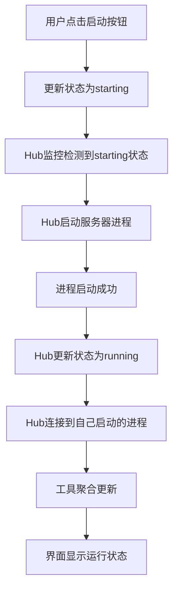
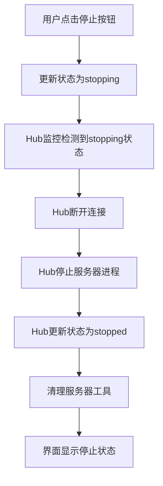
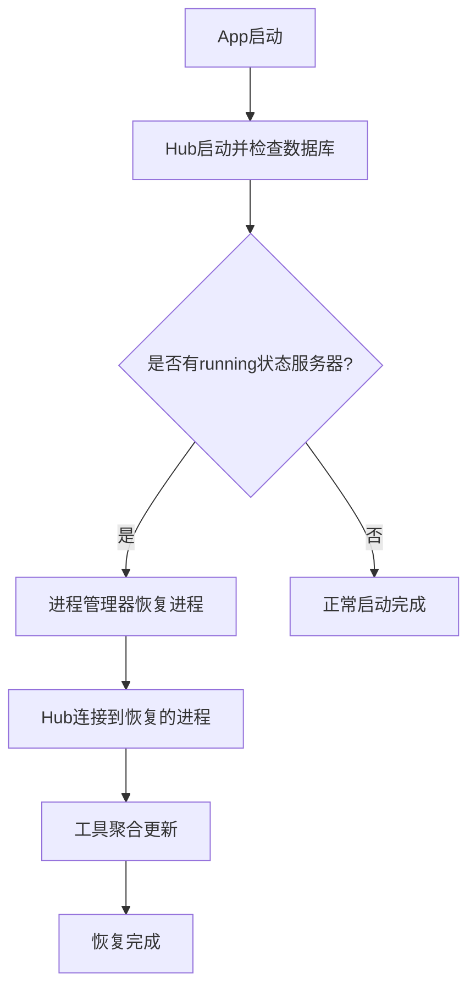
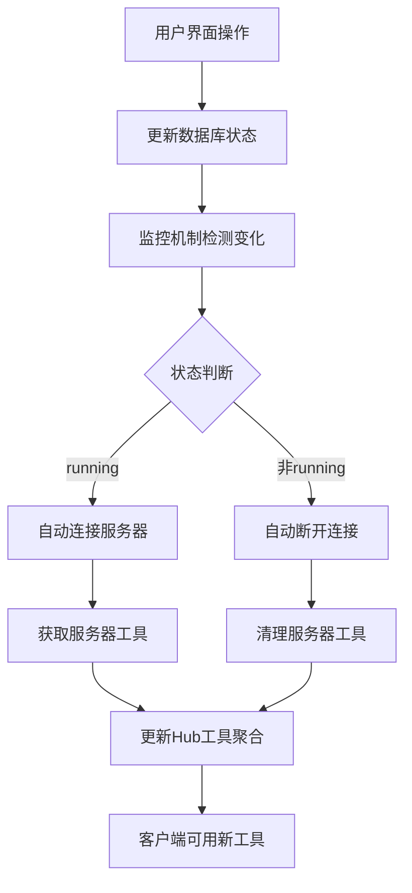

# MCP Hub 业务逻辑重新设计说明

## 🎯 核心设计理念

### 1. **以 mcpServers 配置为核心**
- **配置是必填项**：所有MCP服务器都必须有正确的配置才能运行
- **配置决定安装方式**：系统根据配置自动判断最佳安装策略
- **一站式流程**：安装 = 配置 + 安装 + 添加到列表

### 2. **智能安装策略检测**
系统根据 `mcpServers` 配置中的 `command` 字段自动判断安装方式：

#### 自动安装（无需额外配置）
- **`uvx` 命令** → UVX策略：自动使用uv工具安装Python包
- **`npx` 命令** → NPX策略：自动使用npm安装Node.js包

#### 手动配置安装（需要额外步骤）
- **`python`/`python3` 命令** → PIP策略：需要配置安装源
- **`node` 命令** → NPM策略：需要配置安装源
- **其他自定义命令** → 本地策略：需要手动配置

### 3. **数据库状态驱动的实时连接管理** 🆕
- **状态驱动**：MCP Hub根据数据库中的服务器状态自动连接/断开
- **实时监控**：每5秒检查数据库状态变化
- **解耦设计**：界面操作只负责更新状态，Hub负责连接管理
- **工具聚合**：连接变化时立即更新Hub的工具列表

### 4. **Hub Client统一管理架构** 🚀🆕
- **统一入口管理**：所有子MCP服务器的启动、停止、连接都由Hub的dart_mcp client负责
- **用户操作简化**：用户界面操作只负责更新数据库状态（starting/stopping）
- **Hub监控执行**：Hub监控检测数据库状态变化，执行实际的进程管理和连接
- **彻底避免冲突**：解决了StdioClientTransport的双重进程启动问题
- **错误处理统一**：所有错误处理逻辑集中在Hub中

## 🔄 用户操作流程

### 安装MCP服务器（主要流程）

#### 第一步：配置服务器信息
- 填写服务器名称和描述
- **核心：配置 mcpServers JSON**
  - 包含启动命令、参数、环境变量
  - 系统提供示例配置模板
  - 实时验证配置格式

#### 第二步：自动分析安装策略
- 系统解析配置中的 `command` 字段
- 自动判断是否需要额外安装步骤
- 显示分析结果和安装策略

#### 第三步：配置安装选项（可选）
- **如果使用 uvx/npx**：跳过此步骤
- **如果使用其他命令**：
  - 选择安装源类型（GitHub/本地路径）
  - 配置具体的安装信息
  - 可选择自定义安装命令

#### 第四步：执行安装
- 根据策略执行实际安装
- 实时显示安装日志
- **安装成功后自动添加到服务器列表（状态：installed）**

### 服务器运行管理（核心业务流程）🆕

#### 用户手动启动服务器（统一架构）🆕


**详细步骤**：
1. **用户操作**：在界面点击"启动"按钮
2. **状态更新**：`McpServerService.startServerByUser()` 只更新数据库状态为 `starting`
3. **Hub监控**：Hub每5秒检查数据库状态变化，检测到starting状态
4. **Hub启动**：Hub调用进程管理器启动服务器进程
5. **状态更新**：进程启动成功后，Hub更新状态为 `running`
6. **Hub连接**：Hub立即连接到自己刚启动的进程
7. **工具聚合**：成功连接后立即更新Hub的工具列表
8. **界面反馈**：显示服务器运行状态和连接成功提示

#### 用户手动停止服务器（统一架构）🆕


**详细步骤**：
1. **用户操作**：在界面点击"停止"按钮
2. **状态更新**：`McpServerService.stopServerByUser()` 只更新数据库状态为 `stopping`
3. **Hub监控**：Hub检测到stopping状态
4. **Hub断开**：Hub先断开与该服务器的连接
5. **Hub停止**：Hub调用进程管理器停止服务器进程
6. **状态更新**：Hub更新数据库状态为 `stopped`
7. **工具清理**：从Hub工具列表中移除该服务器的工具
8. **界面反馈**：显示服务器停止状态

#### App启动时的服务器恢复 🚀🆕


**详细步骤**：
1. **App启动**：Flutter应用启动
2. **Hub初始化**：MCP Hub Service启动
3. **状态检查**：检查数据库中是否有running状态的服务器
4. **进程恢复**：使用`McpProcessManager.startServer()`恢复这些服务器的进程
5. **自动连接**：Hub连接到恢复的进程
6. **工具聚合**：更新Hub的工具列表
7. **恢复完成**：用户看到之前运行的服务器自动恢复

### 导入配置（辅助流程）
- 直接导入现有的配置文件
- 适用于已有配置的用户
- 跳过安装步骤，直接添加到列表

## 🎨 界面设计优化

### 主导航栏重新排序
1. **服务器管理**：查看和管理现有服务器
2. **安装服务器**：主要功能，安装新的MCP服务器
3. **导入配置**：辅助功能，导入现有配置
4. **监控**：服务器状态监控
5. **设置**：应用设置

### 服务器列表页面
- **主要按钮**：突出显示"安装MCP服务器"
- **次要按钮**：淡化"导入配置"功能
- **浮动按钮**：快速访问安装功能
- **状态指示器**：实时显示服务器运行状态（installed/running/stopped）🆕
- **操作按钮**：根据状态显示相应的启动/停止按钮🆕

### 安装向导页面
- **步骤化界面**：清晰的4步流程
- **智能提示**：根据配置自动显示相关信息
- **实时反馈**：配置验证和安装进度
- **完成后自动刷新**：安装成功后自动刷新服务器列表🆕

## 🔧 MCP Hub代理架构（核心业务）🆕

### Hub服务器架构
```
MCP Hub Server (端口3000)
├── HTTP API接口
│   ├── /tools - 聚合所有工具
│   ├── /servers - 子服务器状态
│   └── /health - 健康检查
├── 数据库状态监控器
│   ├── 每5秒检查数据库状态
│   ├── 检测running状态的服务器
│   └── 自动连接/断开管理
└── 子服务器连接池
    ├── 管理所有活跃连接
    ├── 工具聚合和路由
    └── 实时状态同步
```

### 状态驱动的连接管理


### Hub Client统一管理架构职责分工 🚀🆕

#### 用户界面（UI）职责：
- **操作触发**：响应用户的启动/停止按钮点击
- **状态更新**：调用服务层更新数据库状态（starting/stopping）
- **状态显示**：实时显示服务器的运行状态
- **不执行实际操作**：不直接启动/停止进程或建立连接

#### 服务层（McpServerService）职责：
- **状态管理**：线程安全的数据库状态更新
- **用户操作接口**：`startServerByUser()` / `stopServerByUser()`
- **状态验证**：检查服务器当前状态，避免重复操作
- **不执行实际操作**：不启动进程，只更新数据库状态

#### Hub统一管理器（McpHubService）职责：
- **状态监控**：每5秒检查数据库状态变化（starting/stopping/running）
- **进程启动**：检测到starting状态时，调用进程管理器启动服务器
- **进程停止**：检测到stopping状态时，先断开连接再停止进程
- **连接管理**：连接到自己启动的进程，管理所有子服务器连接
- **工具聚合**：实时更新Hub的工具列表
- **错误处理**：统一处理所有启动/连接/停止过程中的错误
- **状态同步**：根据操作结果更新数据库状态（running/stopped/error）

#### 进程管理器（McpProcessManager）职责：
- **进程操作**：实际执行`Process.start()`创建和停止服务器进程
- **环境管理**：设置正确的工作目录和环境变量
- **命令转换**：处理NPX→npm exec等命令转换
- **进程监控**：监控进程状态，处理异常退出
- **工具聚合**：收集和聚合所有子服务器的工具
- **状态监控**：监控数据库状态变化
- **路由管理**：将工具调用路由到正确的子服务器
- **不启动进程**：只连接，不创建新进程

#### 关键设计原则：
1. **单一职责**：进程管理器管进程，Hub管连接
2. **避免冲突**：只有一个组件负责启动进程
3. **状态驱动**：以数据库状态为唯一真实来源
4. **自动恢复**：App启动时自动恢复之前运行的服务器

### 工具聚合策略
- **Hub自身工具**：ping、get_status、list_servers等管理工具
- **子服务器工具**：动态聚合已连接服务器的所有工具
- **工具路由**：根据工具名称自动路由到对应的子服务器
- **即时更新**：连接状态变化时立即刷新工具列表

## 📋 配置示例

### UVX 示例（自动安装）
```json
{
  "mcpServers": {
    "hotnews": {
      "command": "uvx",
      "args": ["mcp-server-hotnews"],
      "env": {
        "NEWS_API_KEY": "your-api-key"
      }
    }
  }
}
```

### NPX 示例（自动安装）
```json
{
  "mcpServers": {
    "filesystem": {
      "command": "npx",
      "args": ["-y", "@modelcontextprotocol/server-filesystem", "/tmp"]
    }
  }
}
```

### NPX路径修复机制（隔离环境）🆕
```json
{
  "mcpServers": {
    "hotnews": {
      "command": "npm",
      "args": ["exec", "-y", "@wopal/mcp-server-hotnews"],
      "env": {
        "NPM_CONFIG_PREFIX": "/隔离环境路径",
        "NODE_PATH": "/隔离环境路径/lib/node_modules"
      }
    }
  }
}
```

### Python 示例（需要额外配置）
```json
{
  "mcpServers": {
    "custom-server": {
      "command": "python",
      "args": ["-m", "my_mcp_server"],
      "env": {
        "PYTHONPATH": "/path/to/server"
      }
    }
  }
}
```

## 🔧 技术实现

### 核心组件

#### McpHubService（核心代理服务）🆕
```dart
class McpHubService {
  // 数据库状态监控
  Timer? _statusMonitorTimer;
  Set<String> _lastRunningServerIds = <String>{};
  bool _isInitialStartup = true; // 区分首次启动和运行时
  
  // 自动监控和连接管理
  void _startDatabaseStatusMonitoring() {
    _statusMonitorTimer = Timer.periodic(Duration(seconds: 5), (timer) {
      _isInitialStartup = false;
      _monitorDatabaseStatus();
    });
  }
  
  // 区分首次启动恢复和运行时连接
  Future<void> _connectToRunningServer(models.McpServer server) async {
    if (_isInitialStartup) {
      // App启动时：恢复running状态的服务器
      final processManager = McpProcessManager.instance;
      await processManager.startServer(server);
    } else {
      // 运行时：连接到用户手动启动的进程
      await Future.delayed(Duration(seconds: 2));
    }
    // 然后连接到已运行的进程...
  }
}
```

#### McpServerService（服务器状态管理）🆕
```dart
class McpServerService {
  // 用户手动操作：实际启动/停止进程，然后更新数据库状态
  Future<void> updateServerStatus(String serverId, McpServerStatus status) async {
    if (status == McpServerStatus.running) {
      // 启动进程
      final startSuccess = await _processManager.startServer(server);
      if (!startSuccess) {
        throw Exception('Failed to start server: ${server.name}');
      }
    } else if (status == McpServerStatus.stopped) {
      // 停止进程
      await _processManager.stopServer(server);
    }
    
    // 更新数据库状态
    await _repository.updateServer(updatedServer);
  }
}
```

#### PackageManagerService
- **installPackage** 方法：统一的安装接口
- 支持6种安装策略：UVX、NPX、PIP、NPM、Git、本地
- 自动检测项目类型并安装依赖
- **NPX路径修复**：解决隔离环境中的NPX脚本路径问题🆕

#### CommandResolverService（命令解析优化）🆕
```dart
class CommandResolverService {
  // NPX命令转换为npm exec
  static List<String> resolveCommand(String command, List<String> args) {
    if (command == 'npx') {
      return ['npm', 'exec', ...args];
    }
    return [command, ...args];
  }
}
```

#### McpProcessManager（进程管理器）🚀🆕
```dart
class McpProcessManager {
  // 构建启动参数 - 处理NPX转换
  List<String> _buildStartArgs(McpServer server) {
    if (server.installType == McpInstallType.npx && server.command == 'npx') {
      // 使用npm exec代替npx，需要添加exec子命令
      final execArgs = ['exec', ...server.args];
      return execArgs;
    }
    return server.args;
  }
  
  // 获取服务器环境变量 - 添加Node.js隔离环境变量
  Future<Map<String, String>> _getServerEnvironment(McpServer server) async {
    final environment = Map<String, String>.from(Platform.environment);
    
    // 为NPX/Node.js服务器添加特定环境变量
    if (server.installType == McpInstallType.npx || server.command == 'npm') {
      environment['NODE_PATH'] = path.join(nodeBasePath, 'lib', 'node_modules');
      environment['NPM_CONFIG_PREFIX'] = nodeBasePath;
      environment['NPM_CONFIG_CACHE'] = path.join(nodeBasePath, '.npm');
    }
    
    return environment;
  }
  
  // 获取服务器工作目录 - NPX使用Node.js运行时目录
  Future<String> _getServerWorkingDirectory(McpServer server) async {
    if (server.installType == McpInstallType.npx || server.command == 'npm') {
      final nodeExe = await _runtimeManager.getNodeExecutable();
      final nodeBasePath = path.dirname(path.dirname(nodeExe));
      return nodeBasePath;
    }
    // 其他服务器使用独立工作目录...
  }
}
```

#### InstallationWizardPage
- 4步骤的安装向导界面
- 配置解析和验证
- 安装策略自动检测
- 实时安装进度显示
- **真正执行安装过程**：而不是仅添加配置🆕

#### 智能策略检测
```dart
void _analyzeInstallStrategy() {
  final command = firstServer['command'] as String;
  
  if (command == 'uvx') {
    _detectedStrategy = InstallStrategy.uvx;
    _needsAdditionalInstall = false;
  } else if (command == 'npx') {
    _detectedStrategy = InstallStrategy.npx;
    _needsAdditionalInstall = false;
  } else {
    _needsAdditionalInstall = true;
  }
}
```

### 隔离环境和路径修复🆕

#### AssetExtractor NPX路径修复
```dart
Future<void> _fixNodejsRuntimePaths(String extractPath) async {
  // 创建软连接解决NPX脚本路径问题
  await _createSymlink('lib/cli.js', 'node_modules/npm/lib/cli.js');
  await _createSymlink('bin/npm-cli.js', '../lib/node_modules/npm/bin/npm-cli.js');
}
```

#### PackageManagerService 隔离环境安装
```dart
Future<bool> _installWithNpm(String packageName) async {
  final env = {
    'NPM_CONFIG_PREFIX': nodejsPath,
    'NODE_PATH': '$nodejsPath/lib/node_modules',
    'NPM_CONFIG_CACHE': '$nodejsPath/.npm',
  };
  // 强制npm使用隔离环境进行全局安装
}
```

## 🚨 关键架构决策和避坑指南 🚀🆕

### StdioClientTransport双重进程启动问题的最终解决方案

#### ❌ 之前尝试的架构（已废弃）
```
用户点击启动 → 进程管理器启动进程 → 数据库状态=running → 
Hub监控检测 → Hub连接到已运行进程 → 冲突！StdioClientTransport又启动新进程！
```

#### ✅ 最终统一架构（当前实现）🆕
```
用户点击启动 → 状态更新为starting → Hub检测到starting状态 → 
Hub启动进程 → Hub连接到自己启动的进程 → 成功！唯一进程！
```

### 核心设计原则 🆕

1. **Hub统一管理**：所有子服务器的启动、停止、连接都由Hub负责
2. **用户操作解耦**：用户界面只更新数据库状态，不执行实际操作
3. **状态驱动执行**：Hub监控状态变化并执行相应的实际操作
4. **StdioClientTransport正确使用**：让Hub启动并连接进程，避免冲突
5. **错误处理统一**：所有异常在Hub中集中处理和状态同步

### 重要的实现细节

#### StdioClientTransport的行为
- **关键认知**：`StdioClientTransport`会启动新进程，不是连接到已有进程
- **解决方案**：确保Hub连接时，使用与进程管理器相同的命令和参数
- **命令一致性**：Hub连接时必须考虑NPX→npm exec的转换

#### 时序控制
- **启动延迟**：Hub连接前等待2-3秒，确保进程完全启动
- **状态同步**：监控周期5秒，平衡响应速度和系统负载
- **错误恢复**：连接失败时自动将数据库状态重置为installed

#### 环境变量一致性
- **隔离环境**：Hub连接时必须使用与进程管理器相同的环境变量
- **路径设置**：NODE_PATH、NPM_CONFIG_PREFIX等必须一致
- **工作目录**：Hub连接时的工作目录必须与实际进程匹配

### 调试和排错要点

#### 日志关键信息
```
# 正常启动流程应该看到：
🚀 User request: START server
✅ Server process started successfully
🔗 Runtime: Connecting to user-started server
🔧 Connecting with command: /path/to/npm
🔧 Connecting with args: exec -y @wopal/mcp-server-hotnews
✅ Connected to running MCP server
```

#### 常见问题和解决方案
1. **stdio not connected**：Hub尝试启动新进程，检查连接逻辑
2. **spawn sh ENOENT**：工作目录或环境变量不正确
3. **双重进程**：检查是否Hub和进程管理器都在启动进程
4. **连接超时**：增加Hub连接前的等待时间

## 📈 优势总结

### 用户体验
- **简化流程**：一个向导完成所有操作
- **智能化**：自动判断安装方式
- **容错性好**：详细的错误提示和帮助信息
- **实时反馈**：状态变化和连接状态的即时反馈🆕
- **真正可用**：安装完成即可启动使用🆕
- **无缝恢复**：App重启后自动恢复之前运行的服务器🆕

### 业务逻辑
- **配置为核心**：确保所有服务器都有正确配置
- **策略化安装**：支持多种安装方式
- **一致性**：统一的安装和管理流程
- **状态驱动**：基于数据库状态的自动化管理🆕
- **解耦设计**：界面操作与连接管理分离🆕
- **职责清晰**：进程管理和连接管理职责明确分工🆕

### 技术架构
- **模块化设计**：清晰的服务分层
- **可扩展性**：易于添加新的安装策略
- **健壮性**：完善的错误处理机制
- **隔离环境**：完全独立的运行时环境🆕
- **实时监控**：自动化的状态监控和连接管理🆕
- **进程安全**：避免进程冲突和资源竞争🆕

### MCP代理能力🆕
- **工具聚合**：将多个MCP服务器的工具统一暴露
- **自动路由**：根据工具名称自动路由到对应服务器
- **状态同步**：实时同步子服务器的连接状态
- **客户端兼容**：标准MCP协议，兼容所有MCP客户端

## 🚀 后续优化方向

1. **增强GitHub分析**：自动检测仓库结构并生成配置
2. **配置模板库**：提供常用MCP服务器的配置模板
3. **批量操作**：支持批量安装和管理
4. **云端同步**：配置备份和同步功能
5. **高级监控**：性能监控和日志聚合🆕
6. **负载均衡**：多实例MCP服务器的负载均衡🆕
7. **安全增强**：访问控制和权限管理🆕
8. **进程健康检查**：自动检测进程崩溃并重启🆕
9. **资源监控**：监控子服务器的CPU和内存使用🆕 