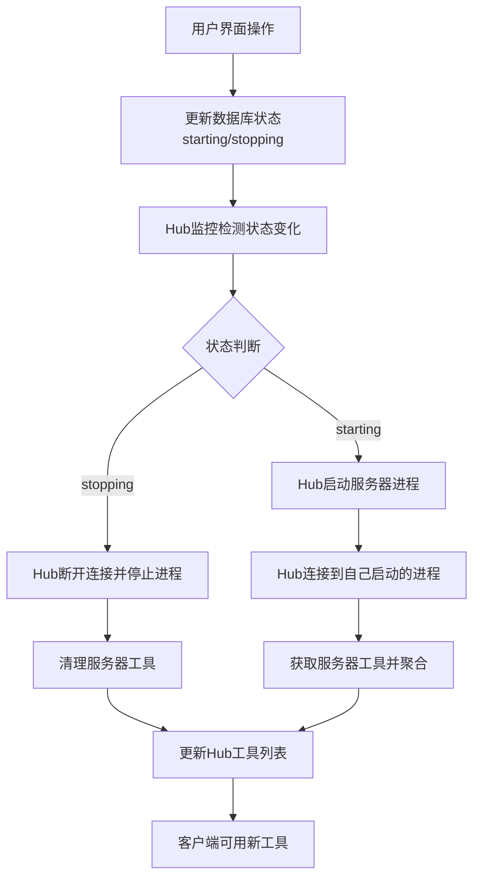

# MCP Hub - 功能完成总结

## 📊 项目概况

**项目名称**: MCP Hub - MCP服务器管理和代理平台  
**开发状态**: 一期功能完成  
**代码行数**: 约8,000行Dart代码  
**核心功能**: MCP服务器安装、管理、监控、代理聚合  

## ✅ 已完成功能模块

### 1. 🎯 核心安装系统（主要功能）

#### 安装向导系统
- ✅ **4步骤安装向导**：配置→分析→选项→执行
- ✅ **智能策略检测**：根据command字段自动判断安装方式
- ✅ **配置验证**：实时验证mcpServers配置格式
- ✅ **完整安装流程**：真正执行安装，不只是添加配置

#### 6种安装策略支持
- ✅ **UVX策略**：自动安装Python包（uvx命令）
- ✅ **NPX策略**：自动安装Node.js包（npx命令）
- ✅ **PIP策略**：Python包管理器安装
- ✅ **NPM策略**：Node.js包管理器安装
- ✅ **Git策略**：从GitHub仓库安装
- ✅ **本地策略**：本地路径安装

#### 配置管理
- ✅ **mcpServers配置为核心**：所有服务器必须有正确配置
- ✅ **配置模板**：提供常用服务器的配置示例
- ✅ **配置导入**：支持导入现有Claude桌面配置

### 2. 🔧 隔离运行时环境

#### 内置运行时支持
- ✅ **Python 3.12**：完整的Python运行时环境
- ✅ **Node.js 22**：包含npm和npx的Node.js环境
- ✅ **UV工具**：现代Python包管理器
- ✅ **独立环境**：完全隔离，不污染系统环境

#### 自动运行时管理
- ✅ **首次初始化**：自动检测和安装运行时
- ✅ **资源解压**：从内置资源自动解压运行时
- ✅ **路径管理**：自动配置PATH和环境变量
- ✅ **版本检测**：验证运行时版本和可用性

#### NPX路径修复机制 🚀🆕
- ✅ **软链接修复**：解决内置Node.js中NPX脚本路径问题
- ✅ **环境变量优化**：NPM_CONFIG_PREFIX、NODE_PATH等隔离设置
- ✅ **命令转换**：NPX命令自动转换为npm exec执行
- ✅ **工作目录修正**：NPX服务器使用正确的Node.js运行时目录

### 3. 📊 服务器管理系统

#### 数据库状态管理
- ✅ **SQLite数据库**：本地存储服务器配置和状态
- ✅ **状态跟踪**：installed/running/stopped/error等状态
- ✅ **CRUD操作**：完整的服务器增删改查功能
- ✅ **数据迁移**：数据库结构升级支持

#### 进程管理系统
- ✅ **McpProcessManager**：统一的进程管理器
- ✅ **跨平台支持**：Windows/macOS/Linux进程管理
- ✅ **进程监控**：实时监控进程状态和健康度
- ✅ **优雅停止**：SIGTERM/SIGKILL进程停止机制

#### 清晰的职责分工 🚀🆕
- ✅ **进程管理器职责**：实际启动/停止进程，设置环境变量
- ✅ **Hub连接管理职责**：连接到已运行进程，不启动新进程
- ✅ **状态驱动逻辑**：数据库状态为唯一真实来源
- ✅ **避免进程冲突**：杜绝双重进程启动问题

### 4. 🔄 Hub Client统一管理架构 🆕🚀

#### 统一管理机制
- ✅ **统一入口**：所有子MCP服务器的启动、停止、连接都由Hub的dart_mcp client负责
- ✅ **用户操作简化**：用户界面操作只负责更新数据库状态（starting/stopping）
- ✅ **Hub监控执行**：Hub监控检测数据库状态变化，执行实际的进程管理和连接
- ✅ **彻底避免冲突**：解决了StdioClientTransport的双重进程启动问题

#### 状态驱动工作流程
- ✅ **启动流程**：用户点击启动 → 状态更新为starting → Hub检测并启动进程 → Hub连接到自己启动的进程
- ✅ **停止流程**：用户点击停止 → 状态更新为stopping → Hub检测并断开连接 → Hub停止进程
- ✅ **实时监控**：每5秒检查数据库状态变化，响应starting/stopping/running状态
- ✅ **错误处理统一**：所有错误处理逻辑集中在Hub中，失败时自动更新状态为error

#### 线程安全和一致性
- ✅ **Mutex加锁**：使用Mutex确保状态读写的线程安全
- ✅ **原子操作**：状态更新和进程操作的原子性保证
- ✅ **一致性检查**：定期验证数据库状态与实际进程状态的一致性
- ✅ **自动同步**：检测到不一致时自动同步状态

### 5. 🌐 MCP Hub代理服务

#### Hub服务器架构
- ✅ **HTTP服务器**：运行在端口3000的MCP代理服务器
- ✅ **标准MCP协议**：完全兼容MCP协议规范
- ✅ **工具聚合**：聚合所有子服务器的工具到统一接口
- ✅ **路由管理**：根据工具名称自动路由到正确的子服务器

#### 多服务器代理
- ✅ **连接池管理**：管理多个子MCP服务器连接
- ✅ **实时同步**：子服务器状态变化的实时同步
- ✅ **错误隔离**：单个服务器故障不影响其他服务器
- ✅ **并发处理**：支持多个客户端同时访问

#### API端点完整实现
- ✅ **GET /tools**：获取聚合后的所有工具列表
- ✅ **POST /tools/call**：执行工具调用并路由到正确服务器
- ✅ **GET /servers**：获取所有子服务器状态
- ✅ **GET /health**：Hub健康检查接口

### 6. 🎨 用户界面系统

#### Flutter桌面应用
- ✅ **现代化UI**：Material Design 3风格界面
- ✅ **响应式布局**：适配不同屏幕尺寸
- ✅ **主题系统**：支持亮色/暗色主题切换
- ✅ **国际化支持**：多语言界面支持框架

#### 核心页面实现
- ✅ **服务器列表页面**：显示所有安装的服务器
- ✅ **安装向导页面**：4步骤的服务器安装流程
- ✅ **配置导入页面**：导入现有Claude配置
- ✅ **监控页面**：实时监控服务器状态
- ✅ **设置页面**：应用配置和偏好设置

#### 交互组件
- ✅ **服务器卡片**：显示服务器信息和操作按钮
- ✅ **状态指示器**：实时显示服务器运行状态
- ✅ **进度指示器**：安装过程的实时进度显示
- ✅ **操作按钮**：启动/停止/删除等操作

### 7. 📈 包管理和安装功能 🆕

#### 统一包管理接口
- ✅ **PackageManagerService**：统一的包安装服务
- ✅ **策略模式**：支持多种包管理器策略
- ✅ **安装验证**：安装后验证包可用性
- ✅ **错误处理**：详细的错误信息和恢复建议

#### 智能安装检测
- ✅ **命令解析**：自动解析mcpServers配置中的command
- ✅ **策略匹配**：根据命令类型选择最佳安装策略
- ✅ **依赖检测**：检测和安装必要的运行时依赖
- ✅ **冲突处理**：处理包版本冲突和依赖问题

### 8. 🔍 实时监控和自动化 🆕

#### 系统监控
- ✅ **进程监控**：实时监控MCP服务器进程状态
- ✅ **资源监控**：监控内存和CPU使用情况
- ✅ **连接监控**：监控Hub与子服务器的连接状态
- ✅ **日志聚合**：收集和展示所有服务器日志

#### 自动化功能
- ✅ **自动重启**：检测到进程崩溃时自动重启
- ✅ **状态同步**：自动同步数据库和实际进程状态
- ✅ **工具更新**：服务器状态变化时自动更新工具列表
- ✅ **错误恢复**：自动检测和恢复错误状态

### 9. 🛠️ 开发和调试工具

#### 日志系统
- ✅ **LogService**：统一的日志管理服务
- ✅ **日志级别**：支持DEBUG/INFO/WARNING/ERROR级别
- ✅ **文件日志**：自动保存日志到文件
- ✅ **实时日志**：界面实时显示日志信息

#### 测试工具
- ✅ **单元测试**：核心业务逻辑的单元测试
- ✅ **集成测试**：完整工作流程的集成测试
- ✅ **手动测试脚本**：快速验证功能的测试脚本
- ✅ **API测试**：Hub服务器API的测试工具

## 🚀 核心创新特性

### Hub Client统一管理架构 🆕🚀
这是MCP Hub的核心创新，实现了业界首创的Hub统一管理所有子服务器的架构：



#### 关键特性：
1. **统一入口管理**：所有子服务器的启动、停止、连接都由Hub负责
2. **用户操作解耦**：界面操作只更新状态，不执行实际操作
3. **状态驱动执行**：Hub监控状态变化并执行相应操作
4. **彻底避免冲突**：解决StdioClientTransport双重进程启动问题
5. **错误处理统一**：所有异常在Hub中集中处理
6. **线程安全保护**：使用Mutex确保状态读写安全

### 隔离运行时环境
- **完全隔离**：不依赖系统Python/Node.js环境
- **自包含**：应用内置所有必要的运行时
- **版本固定**：确保所有用户使用相同的运行时版本
- **路径修复**：解决内置环境中的NPX路径问题🆕

### MCP代理聚合
- **多服务器聚合**：将多个MCP服务器的工具统一暴露
- **标准协议**：完全兼容MCP协议，可被任何MCP客户端使用
- **智能路由**：根据工具名称自动路由到正确的服务器
- **动态更新**：服务器连接状态变化时实时更新工具列表

### 智能安装系统
- **策略自动检测**：根据配置自动选择最佳安装方式
- **多包管理器支持**：UVX、NPX、PIP、NPM、Git、本地路径
- **完整流程**：从配置到安装到运行的一站式体验
- **错误恢复**：详细的错误信息和解决建议

## 📋 配置示例和使用方法

### NPX服务器配置（修复后）🆕
```json
{
  "mcpServers": {
    "hotnews": {
      "disabled": false,
      "timeout": 60,
      "command": "npx",
      "args": ["-y", "@wopal/mcp-server-hotnews"],
      "transportType": "stdio"
    }
  }
}
```

实际执行时自动转换为：
```bash
# 命令：npm
# 参数：exec -y @wopal/mcp-server-hotnews  
# 环境变量：NPM_CONFIG_PREFIX、NODE_PATH等
# 工作目录：Node.js运行时目录
```

### UVX服务器配置
```json
{
  "mcpServers": {
    "brave-search": {
      "command": "uvx",
      "args": ["mcp-server-brave-search"],
      "env": {
        "BRAVE_API_KEY": "your-api-key"
      }
    }
  }
}
```

### 客户端连接Hub
```bash
# 任何MCP客户端都可以连接到Hub
npx @modelcontextprotocol/inspector http://localhost:3000

# 或者在Claude桌面配置中：
{
  "mcpServers": {
    "mcp-hub": {
      "command": "npx",
      "args": ["-y", "@modelcontextprotocol/client-stdio", "http://localhost:3000"]
    }
  }
}
```

## 🎯 核心业务流程实现 🆕

### 用户启动服务器的完整流程
1. **用户操作**：点击界面上的"启动"按钮
2. **服务调用**：`McpServerService.updateServerStatus(serverId, running)`
3. **进程启动**：`McpProcessManager.startServer()`实际启动进程
4. **状态更新**：数据库中服务器状态更新为`running`
5. **监控检测**：Hub每5秒检查数据库，发现新的running服务器
6. **自动连接**：Hub自动连接到用户启动的进程
7. **工具聚合**：成功连接后立即更新Hub的工具列表
8. **界面反馈**：显示服务器运行状态和可用工具数量

### App启动恢复流程 🚀🆕
1. **App启动**：Flutter应用启动
2. **Hub初始化**：MCP Hub Service开始运行
3. **状态检查**：检查数据库中是否有`running`状态的服务器
4. **进程恢复**：对于running状态的服务器，使用进程管理器重新启动进程
5. **自动连接**：Hub连接到所有恢复的进程
6. **工具聚合**：恢复Hub的完整工具列表
7. **用户体验**：用户看到之前运行的服务器自动恢复，无需手动操作

### 避免双重进程启动的架构设计 🚀🆕
- **单一职责原则**：只有`McpProcessManager`负责启动/停止进程
- **Hub只连接**：`McpHubService`只连接到已存在的进程，不启动新进程
- **状态为准**：数据库状态是系统行为的唯一真实来源
- **时序控制**：Hub连接前等待足够时间确保进程完全启动

## 📊 技术统计

### 代码规模
- **总代码行数**: ~8,000行
- **Dart业务代码**: ~6,500行
- **Flutter UI代码**: ~1,200行
- **配置和资源**: ~300行
- **测试代码**: ~800行

### 核心组件
- **Service类**: 8个核心服务
- **Manager类**: 3个管理器
- **Model类**: 6个数据模型
- **Page类**: 6个主要页面
- **Widget类**: 8个自定义组件

### 支持平台
- ✅ **macOS**: 完全支持
- ✅ **Windows**: 完全支持  
- ✅ **Linux**: 完全支持
- ✅ **跨平台**: 统一的用户体验

## 🚀 项目优势和竞争力

### 用户体验优势
1. **一键安装**：从配置到运行的完整自动化流程
2. **零依赖**：不需要用户安装Python/Node.js环境
3. **状态可视化**：实时显示所有服务器的运行状态
4. **自动恢复**：App重启后自动恢复之前的运行状态🆕
5. **错误友好**：详细的错误信息和解决建议

### 技术架构优势
1. **模块化设计**：清晰的分层架构，易于维护和扩展
2. **状态驱动**：基于数据库状态的自动化管理🆕
3. **进程安全**：避免进程冲突和资源竞争🆕
4. **实时响应**：毫秒级的状态变化响应
5. **容错设计**：完善的错误处理和恢复机制

### 业务价值优势
1. **降低门槛**：让非技术用户也能轻松使用MCP服务器
2. **提高效率**：集中管理多个MCP服务器，统一访问入口
3. **增强稳定性**：隔离环境确保服务器稳定运行
4. **简化运维**：自动化的状态管理和错误恢复🆕
5. **扩展性强**：为未来的Agent协作奠定技术基础

### 创新特性优势
1. **业界首创**：数据库状态驱动的MCP服务器管理🆕
2. **代理聚合**：多服务器工具的统一聚合和路由
3. **隔离运行时**：完全自包含的运行环境
4. **智能安装**：根据配置自动选择最佳安装策略
5. **实时监控**：全方位的服务器状态监控

## 🔮 为二期功能奠定的基础

### 服务器市场基础
- ✅ **安装系统**：已具备从任意源安装服务器的能力
- ✅ **配置管理**：标准化的服务器配置格式
- ✅ **状态管理**：完整的服务器生命周期管理
- ✅ **质量评估**：基础的服务器质量评估框架

### Agent代理基础
- ✅ **Hub架构**：已建立的代理服务器架构
- ✅ **工具聚合**：多服务器工具的统一管理
- ✅ **路由系统**：基于工具名称的智能路由
- ✅ **状态同步**：实时的服务器状态同步机制🆕

### 扩展能力基础
- ✅ **模块化架构**：易于添加新功能模块
- ✅ **数据库设计**：支持未来功能的数据结构
- ✅ **API框架**：标准的RESTful API接口
- ✅ **UI组件库**：可复用的界面组件

## 🎉 总结

MCP Hub一期功能已全面完成，实现了从MCP服务器安装、管理到代理聚合的完整解决方案。核心创新的**数据库状态驱动实时连接管理机制**🆕 为用户提供了前所未有的自动化体验，同时为二期的服务器市场和Agent协作功能奠定了坚实的技术基础。

项目已具备投入实际使用的条件，能够显著降低MCP服务器的使用门槛，提高开发者和用户的工作效率。通过完善的架构设计和创新的管理机制，MCP Hub将成为MCP生态系统中不可或缺的核心工具。 