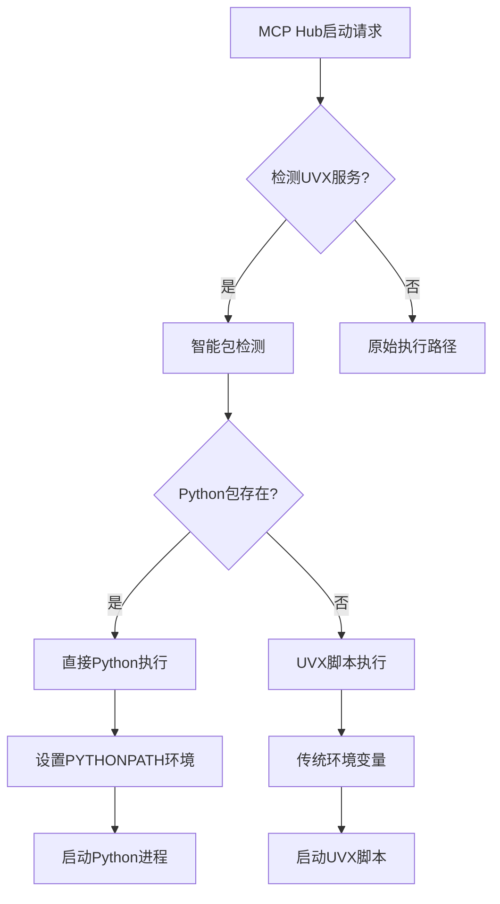

# MCP Hub - 跨平台MCP服务器管理应用

## 项目概述

### 背景
Model Context Protocol (MCP) 是一个用于AI应用与各种工具和服务交互的统一协议。目前，MCP服务器的安装、配置和管理对于非技术用户来说过于复杂，需要熟悉Python、Node.js包管理工具以及命令行操作。

### 项目目标
开发一个跨平台的Flutter桌面应用程序，为用户（特别是非技术用户）提供图形化的MCP服务器管理解决方案，简化MCP服务器的安装、启动、停止和配置过程。

### 核心价值主张
- **开箱即用**：内置Python和Node.js运行时环境，无需用户预安装
- **统一管理**：通过单一应用管理所有MCP服务器
- **协议中转**：作为MCP客户端和服务器之间的智能代理
- **用户友好**：图形化界面，适合非技术用户

## 功能需求

### 核心功能

#### 1. MCP服务器管理
- **配置驱动安装**
  - 用户必须提供完整的`mcpServers`配置
  - 根据配置智能判断安装策略
  - 支持自包含命令（npx/uvx带安装）
  - 支持预安装命令（需要额外安装步骤）
  - 支持本地源码安装（GitHub/本地目录）

- **生命周期管理**
  - 启动/停止MCP服务器
  - 自动重启崩溃的服务器
  - 服务器状态监控
  - 资源使用情况监控

- **配置管理**
  - 服务器配置编辑
  - 环境变量管理
  - 依赖版本管理
  - 配置备份和恢复
  - 下载设置管理（镜像源配置）

#### 2. MCP协议中转
- **STDIO模式中转**
  ```
  MCP Client (Cursor/Cherry Studio) 
      ↓ [MCP Protocol]
  MCP Hub (Flutter APP)
  ├─ 对外: MCP Server (使用mcp_dart实现)
  └─ 对内: MCP Client (连接各个子server)
      ↓ [stdin/stdout]
  子MCP Servers (Python/Node通过uvx/npx启动)
  ```

- **SSE模式管理**
  ```
  MCP Client → [HTTP/SSE] → MCP Server (直连)
  Hub → 仅负责管理Server生命周期
  ```

#### 3. 用户界面
- **主面板**
  - 服务器列表视图
  - 服务器状态指示器
  - 快速启动/停止按钮
  - 资源使用统计

- **服务器详情**
  - 配置信息展示/编辑
  - 日志查看器
  - 连接时间统计
  - 性能监控图表

- **安装向导**
  - 包搜索和浏览
  - 依赖关系可视化
  - 安装进度指示
  - 错误处理和重试

- **设置页面**
  - 应用外观设置（主题、语言）
  - 应用行为设置（自启动、系统托盘）
  - 下载设置（镜像源配置）
  - 日志和存储管理

### 4. 下载设置功能（镜像源管理）

#### 4.1 功能概述
为了解决全球用户在包下载时遇到的网络访问差异问题，MCP Hub提供了智能化的镜像源配置功能。该功能针对不同地区用户的网络环境特点，提供灵活的下载源选择。

#### 4.2 设计理念
- **全球化兼容**：默认使用官方源，保证全球标准体验
- **地域优化**：为特定地区（如中国大陆）提供加速镜像选项
- **用户控制**：用户可根据实际网络环境手动选择最优源
- **透明配置**：清晰显示当前使用的镜像源和预期效果

#### 4.3 核心功能

**4.3.1 镜像源管理**
```json
{
  "download": {
    "use_china_mirrors": false,
    "python_mirror_url": "https://pypi.org/simple",
    "python_mirror_url_china": "https://pypi.tuna.tsinghua.edu.cn/simple",
    "npm_mirror_url": "https://registry.npmjs.org/",
    "npm_mirror_url_china": "https://registry.npmmirror.com/",
    "timeout_seconds": 120,
    "concurrent_downloads": 4
  }
}
```

**4.3.2 支持的镜像源**

| 包管理器 | 官方源 | 中国镜像源 | 说明 |
|---------|--------|------------|------|
| **Python/PyPI** | pypi.org | 清华大学镜像源 | Python包下载加速 |
| **NPM** | npmjs.org | 淘宝镜像源 | Node.js包下载加速 |

**4.3.3 用户界面设计**
- **主开关**：使用中国大陆镜像源（默认关闭）
- **状态显示**：当前使用的镜像源信息
- **效果说明**：镜像源带来的速度提升和网络优势
- **实时反馈**：设置变更后的即时确认

#### 4.4 技术实现

**4.4.1 配置管理架构**
```dart
class ConfigService {
  // 镜像源配置
  Future<bool> getUseChinaMirrors() async;
  Future<void> setUseChinaMirrors(bool enabled) async;
  Future<String> getPythonMirrorUrl() async;
  Future<String> getNpmMirrorUrl() async;
  
  // 性能配置
  Future<int> getDownloadTimeoutSeconds() async;
  Future<int> getConcurrentDownloads() async;
}
```

**4.4.2 全链路镜像源支持**
1. **安装阶段**（PackageManagerService）
   ```dart
   // UV Python包安装
   environment['UV_INDEX_URL'] = await configService.getPythonMirrorUrl();
   
   // NPM包安装
   environment['NPM_CONFIG_REGISTRY'] = await configService.getNpmMirrorUrl();
   ```

2. **运行阶段**（McpProcessManager）
   ```dart
   // Python服务器运行时环境
   environment['UV_INDEX_URL'] = await configService.getPythonMirrorUrl();
   environment['UV_HTTP_TIMEOUT'] = '${await configService.getDownloadTimeoutSeconds()}';
   
   // Node.js服务器运行时环境
   environment['NPM_CONFIG_REGISTRY'] = await configService.getNpmMirrorUrl();
   ```

**4.4.3 环境变量映射**

| 配置项 | Python环境变量 | NPM环境变量 | 说明 |
|-------|---------------|-------------|------|
| 镜像源URL | `UV_INDEX_URL` | `NPM_CONFIG_REGISTRY` | 主要包源地址 |
| 备用源 | `UV_EXTRA_INDEX_URL` | - | 备用包源地址 |
| 超时时间 | `UV_HTTP_TIMEOUT` | - | 下载超时设置 |
| 并发数 | `UV_CONCURRENT_DOWNLOADS` | - | 并发下载数 |

#### 4.5 用户体验设计

**4.5.1 智能提示**
- 启用镜像源后显示速度提升预期（5-10倍）
- 网络连接问题解决说明
- 支持的包类型说明（Python + NPM）

**4.5.2 状态透明**
- 实时显示当前使用的镜像源
- 区分官方源和镜像源状态
- 配置变更的即时生效确认

**4.5.3 错误处理**
- 镜像源连接失败时自动回退到官方源
- 配置加载失败时使用安全默认值
- 用户友好的错误提示信息

#### 4.6 性能优化

**4.6.1 下载加速效果**
- **中国大陆用户**：
  - PyPI官方源：通常 < 100KB/s，经常超时
  - 清华镜像源：通常 > 1MB/s，稳定连接
  - NPM官方源：通常 < 50KB/s，间歇性中断
  - 淘宝镜像源：通常 > 500KB/s，可靠连接

**4.6.2 配置优化**
- 默认超时时间：120秒（平衡兼容性和响应速度）
- 默认并发下载数：4（优化下载效率和系统资源）
- 智能缓存：重复包下载自动使用本地缓存

#### 4.7 全球化支持

**4.7.1 地区适配策略**
- **全球默认**：使用官方源，保证标准性和实时性
- **中国大陆**：提供镜像源选项，解决网络访问问题
- **其他地区**：保持官方源，确保最佳兼容性

**4.7.2 文化敏感性**
- 界面文案：中性描述，避免地域偏见
- 功能命名：使用技术术语，不暗示地区问题
- 用户选择：完全由用户决定，不自动判断地区

## 技术架构

### 整体架构图

```
┌─────────────────────────────────────────────────────────────┐
│                    MCP Hub Application                      │
├─────────────────────────────────────────────────────────────┤
│                    Presentation Layer                      │
│  ┌─────────────┐ ┌─────────────┐ ┌─────────────────────────┐ │
│  │  Main View  │ │ Server View │ │    Installation View   │ │
│  └─────────────┘ └─────────────┘ └─────────────────────────┘ │
├─────────────────────────────────────────────────────────────┤
│                    Business Logic Layer                    │
│  ┌─────────────┐ ┌─────────────┐ ┌─────────────────────────┐ │
│  │   Server    │ │    MCP      │ │     Package Manager    │ │
│  │  Manager    │ │   Proxy     │ │                         │ │
│  └─────────────┘ └─────────────┘ └─────────────────────────┘ │
├─────────────────────────────────────────────────────────────┤
│                     Service Layer                          │
│  ┌─────────────┐ ┌─────────────┐ ┌─────────────────────────┐ │
│  │   Process   │ │   Config    │ │      Runtime Manager   │ │
│  │  Manager    │ │  Manager    │ │                         │ │
│  └─────────────┘ └─────────────┘ └─────────────────────────┘ │
├─────────────────────────────────────────────────────────────┤
│                   Infrastructure Layer                     │
│  ┌─────────────┐ ┌─────────────┐ ┌─────────────────────────┐ │
│  │   Python    │ │   Node.js   │ │    File System          │ │
│  │  Runtime    │ │   Runtime   │ │                         │ │
│  └─────────────┘ └─────────────┘ └─────────────────────────┘ │
└─────────────────────────────────────────────────────────────┘
```

### 分层架构详述

#### 1. Presentation Layer (表示层)

**技术栈**: Flutter + Dart

**组件**:
- `MainView`: 主界面，服务器列表和状态概览
- `ServerDetailView`: 服务器详情页面
- `InstallationView`: 安装和配置向导
- `SettingsView`: 应用设置页面

**关键特性**:
- 响应式UI设计
- 主题切换支持
- 国际化支持
- 桌面平台适配

#### 2. Business Logic Layer (业务逻辑层)

**核心组件**:

```dart
// 服务器管理器
class ServerManager {
  List<MCPServerInstance> servers = [];
  
  Future<void> startServer(String serverId);
  Future<void> stopServer(String serverId);
  Future<void> restartServer(String serverId);
  Stream<ServerStatus> watchServerStatus(String serverId);
}

// MCP协议代理
class MCPProxy {
  final Map<String, MCPServerConnection> connections = {};
  
  Future<void> setupStdioProxy(MCPServerInstance server);
  Future<void> setupSSEProxy(MCPServerInstance server);
  Future<MCPResponse> routeRequest(MCPRequest request);
}

// 包管理器
class PackageManager {
  Future<List<PackageInfo>> searchPackages(String query);
  Future<void> installPackage(PackageInfo package);
  Future<void> updatePackage(String packageId);
  Future<void> uninstallPackage(String packageId);
}
```

#### 3. Service Layer (服务层)

**进程管理服务**:
```dart
class ProcessManager {
  final Map<String, Process> _processes = {};
  
  Future<Process> startProcess(ProcessConfig config);
  Future<void> killProcess(String processId);
  Stream<ProcessOutput> watchProcessOutput(String processId);
}
```

**配置管理服务**:
```dart
class ConfigManager {
  Future<ServerConfig> loadConfig(String serverId);
  Future<void> saveConfig(String serverId, ServerConfig config);
  Future<void> validateConfig(ServerConfig config);
}
```

**运行时管理服务**:
```dart
class RuntimeManager {
  Future<void> ensurePythonRuntime();
  Future<void> ensureNodeRuntime();
  Future<String> getPythonExecutable();
  Future<String> getNodeExecutable();
}
```

#### 4. Infrastructure Layer (基础设施层)

**运行时环境**:
- **Python Runtime**: 基于 `serious_python` 包
  - Python 3.12.6
  - 预装pip和常用包
  - 支持uvx工具

- **Node.js Runtime**: 自定义集成
  - Node.js LTS版本
  - 预装npm和npx
  - 支持Bun (可选)

**数据存储**:
```dart
// 配置存储
class ConfigStorage {
  Future<void> saveServerConfig(String id, Map<String, dynamic> config);
  Future<Map<String, dynamic>?> loadServerConfig(String id);
}

// 日志存储
class LogStorage {
  Future<void> writeLog(String serverId, LogEntry entry);
  Stream<LogEntry> readLogs(String serverId);
}

// SQLite数据库管理
class DatabaseManager {
  Future<Database> get database;
  Future<void> initializeDatabase();
  Future<void> closeDatabase();
}
```

### 5. 跨平台环境支持

#### 5.1 概述
MCP Hub支持Windows、macOS和Linux三大桌面平台，通过统一的环境配置接口确保在不同操作系统上的一致性表现。针对每个平台的特殊性，提供了相应的PATH环境变量、文件系统路径和运行时配置。

#### 5.2 支持的平台

| 平台 | 版本要求 | 架构支持 | 状态 |
|------|----------|----------|------|
| **macOS** | 10.15+ | Intel x64, Apple Silicon arm64 | ✅ 完全支持 |
| **Windows** | Windows 10+ | x64, arm64 | ✅ 完全支持 |
| **Linux** | Ubuntu 18.04+ | x64, arm64 | ✅ 完全支持 |

#### 5.3 跨平台PATH环境变量配置

**5.3.1 macOS/Linux系统PATH**
```bash
/usr/local/bin      # Homebrew (Intel Mac) / 本地安装工具
/opt/homebrew/bin   # Homebrew (Apple Silicon Mac)
/usr/bin           # 系统二进制文件
/bin               # 基本系统工具 (realpath, dirname, etc.)
/usr/sbin          # 系统管理工具
/sbin              # 基本系统管理工具
```

**5.3.2 Windows系统PATH**
```cmd
C:\Windows\System32                # Windows系统工具
C:\Windows                         # Windows基本工具
C:\Windows\System32\Wbem           # WMI工具
C:\Program Files\Git\usr\bin       # Git Bash工具
C:\Program Files\Git\bin           # Git工具
```

#### 5.4 跨平台环境变量映射

**5.4.1 基础环境变量**

| 变量名 | Windows | macOS/Linux | 说明 |
|--------|---------|-------------|------|
| **HOME** | `%USERPROFILE%` | `$HOME` | 用户主目录 |
| **USER** | `%USERNAME%` | `$USER` | 当前用户名 |
| **TMPDIR** | `%TEMP%` | `$TMPDIR` | 临时文件目录 |
| **SHELL** | `cmd.exe` | `/bin/sh` | 默认Shell |
| **LANG** | `en_US.UTF-8` | `en_US.UTF-8` | 字符编码 |
| **LC_ALL** | *(不设置)* | `en_US.UTF-8` | 本地化设置 |

**5.4.2 Node.js环境变量**

| 变量名 | Windows | macOS/Linux | 说明 |
|--------|---------|-------------|------|
| **NODE_PATH** | `{nodeBase}/node_modules` | `{nodeBase}/lib/node_modules` | Node模块路径 |
| **NPM_CONFIG_CACHE** | `{nodeBase}/npm-cache` | `{nodeBase}/.npm` | NPM缓存目录 |
| **NPM_CONFIG_PREFIX** | `{nodeBase}` | `{nodeBase}` | NPM全局安装前缀 |
| **NPM_CONFIG_REGISTRY** | *(镜像源配置)* | *(镜像源配置)* | NPM包源地址 |

**5.4.3 Python/UV环境变量**

| 变量名 | 所有平台 | 说明 |
|--------|----------|------|
| **UV_CACHE_DIR** | `~/.mcphub/cache/uv` | UV缓存目录 |
| **UV_DATA_DIR** | `~/.mcphub/data/uv` | UV数据目录 |
| **UV_TOOL_DIR** | `~/.mcphub/packages/uv/tools` | UV工具安装目录 |
| **UV_TOOL_BIN_DIR** | `~/.mcphub/packages/uv/bin` | UV工具可执行文件目录 |
| **UV_INDEX_URL** | *(镜像源配置)* | Python包源地址 |
| **UV_HTTP_TIMEOUT** | *(配置值)* | 下载超时时间 |
| **UV_CONCURRENT_DOWNLOADS** | *(配置值)* | 并发下载数 |

#### 5.5 跨平台文件系统路径

**5.5.1 用户数据目录结构**
```
# Windows
C:\Users\{username}\.mcphub\
├── runtimes\          # 运行时环境
├── packages\          # 包安装目录
├── cache\             # 缓存目录
├── servers\           # 服务器工作目录
├── config\            # 配置文件
└── logs\              # 日志文件

# macOS/Linux
/Users/{username}/.mcphub/     # macOS
/home/{username}/.mcphub/      # Linux
├── runtimes/          # 运行时环境
├── packages/          # 包安装目录
├── cache/             # 缓存目录
├── servers/           # 服务器工作目录
├── config/            # 配置文件
└── logs/              # 日志文件
```

**5.5.2 运行时环境路径结构**
```
runtimes/
├── python/
│   ├── windows/
│   │   ├── x64/python-3.12.6/
│   │   │   ├── python.exe
│   │   │   ├── Scripts/         # Windows脚本目录
│   │   │   └── Lib/
│   │   └── arm64/
│   ├── macos/
│   │   ├── x64/python-3.12.6/
│   │   │   ├── bin/
│   │   │   │   ├── python3
│   │   │   │   └── python
│   │   │   └── lib/
│   │   └── arm64/
│   └── linux/
│       ├── x64/
│       └── arm64/
└── nodejs/
    ├── windows/
    │   ├── x64/node-v20.10.0/
    │   │   ├── node.exe
    │   │   ├── npm.cmd          # Windows批处理文件
    │   │   └── node_modules/
    │   └── arm64/
    ├── macos/
    │   ├── x64/node-v20.10.0/
    │   │   ├── bin/
    │   │   │   ├── node
    │   │   │   ├── npm          # Unix可执行文件
    │   │   │   └── npx
    │   │   └── lib/node_modules/
    │   └── arm64/
    └── linux/
        ├── x64/
        └── arm64/
```

#### 5.6 平台特定实现

**5.6.1 可执行文件处理**
```dart
class PathConstants {
  // 平台特定扩展名
  static String getExecutableExtension() {
    return Platform.isWindows ? '.exe' : '';
  }
  
  static String getScriptExtension() {
    return Platform.isWindows ? '.cmd' : '';
  }
  
  // 平台名称映射
  static String getPlatformName() {
    if (Platform.isWindows) return 'windows';
    if (Platform.isMacOS) return 'macos';
    if (Platform.isLinux) return 'linux';
    throw UnsupportedError('Unsupported platform');
  }
}
```

**5.6.2 架构检测**
```dart
static String getArchitectureName() {
  if (Platform.isWindows) {
    return Platform.environment['PROCESSOR_ARCHITECTURE'] == 'ARM64' 
        ? 'arm64' : 'x64';
  } else if (Platform.isMacOS) {
    final result = Process.runSync('uname', ['-m']);
    return result.stdout.toString().trim() == 'arm64' ? 'arm64' : 'x64';
  } else if (Platform.isLinux) {
    final result = Process.runSync('uname', ['-m']);
    final arch = result.stdout.toString().trim();
    return (arch == 'aarch64' || arch == 'arm64') ? 'arm64' : 'x64';
  }
  return 'x64'; // 默认
}
```

#### 5.7 平台特定问题解决

**5.7.1 Shell工具兼容性**
- **问题**：UVX生成的启动脚本使用`realpath`、`dirname`等Unix工具
- **解决方案**：
  - macOS/Linux：确保PATH包含`/bin`、`/usr/bin`
  - Windows：包含Git Bash路径提供Unix工具兼容

**5.7.2 文件路径分隔符**
- **问题**：不同平台使用不同的路径分隔符
- **解决方案**：统一使用Dart的`path.join()`方法

**5.7.3 权限管理**
- **Windows**：使用用户目录，避免管理员权限要求
- **macOS/Linux**：使用用户主目录，符合Unix惯例

#### 5.8 测试覆盖

**5.8.1 自动化测试**
- 所有三个平台的CI/CD管道
- 架构特定的运行时测试
- 环境变量配置验证

**5.8.2 手动测试检查清单**
- [ ] 运行时环境正确初始化
- [ ] PATH环境变量包含必要工具
- [ ] 文件权限正确设置
- [ ] 跨平台配置文件兼容
- [ ] 服务器启动成功

## 技术实现方案

### 依赖包选择

```yaml
dependencies:
  flutter:
    sdk: flutter
  
  # MCP协议支持
  mcp_dart: ^1.0.0
  
  # Python运行时
  serious_python: ^0.9.2
  
  # 进程管理
  process_run: ^0.12.0
  
  # HTTP服务器 (SSE支持)
  shelf: ^1.4.0
  shelf_router: ^1.1.0
  
  # 文件系统操作
  path_provider: ^2.0.0
  path: ^1.8.0
  
  # 状态管理
  riverpod: ^2.0.0
  
  # 桌面功能
  window_manager: ^0.3.0
  tray_manager: ^0.2.0
  
  # 数据持久化
  hive: ^2.2.0
  hive_flutter: ^1.1.0
  sqflite_common_ffi: ^2.3.0  # SQLite支持（桌面平台）
  
  # 网络请求
  dio: ^5.0.0
  
  # JSON处理
  json_annotation: ^4.8.0
  
  # 归档解压
  archive: ^3.4.0
  
  # Git操作
  git: ^2.2.0
  
  # YAML解析
  yaml: ^3.1.0
  
  # 日志
  logger: ^2.0.0

dev_dependencies:
  # 代码生成
  build_runner: ^2.4.0
  json_serializable: ^6.6.0
  hive_generator: ^2.0.0
```

## 内置运行时环境设计

### 运行时版本规划

#### Python环境
- **Python版本**: 3.12.6 ✅ (已实际部署)
- **UV版本**: 0.7.13 ✅ (已实际部署，比原计划0.4.18更新)
- **Pip版本**: 随Python内置版本 ✅ (已验证)

#### Node.js环境  
- **Node.js版本**: 20.10.0 LTS ✅ (已实际部署)
- **NPM版本**: 随Node.js内置版本 ✅ (已验证)
- **NPX版本**: 随Node.js内置版本 ✅ (已验证)
- **Corepack**: 随Node.js内置版本 ✅ (已验证)

### 目录结构设计

```
assets/
├── runtimes/
│   ├── python/
│   │   ├── windows/
│   │   │   ├── x64/
│   │   │   │   ├── python-3.12.6/
│   │   │   │   │   ├── python.exe
│   │   │   │   │   ├── python312.dll
│   │   │   │   │   ├── python312._pth
│   │   │   │   │   └── Lib/
│   │   │   │   └── uv-0.7.13/
│   │   │   │       ├── uv.exe
│   │   │   │       └── uvx.exe
│   │   │   └── arm64/
│   │   │       ├── python-3.12.6/
│   │   │       └── uv-0.7.13/
│   │   ├── linux/
│   │   │   ├── x64/
│   │   │   │   ├── python-3.12.6/
│   │   │   │   │   ├── bin/
│   │   │   │   │   │   ├── python3
│   │   │   │   │   │   ├── python
│   │   │   │   │   │   ├── pip3
│   │   │   │   │   │   └── pip
│   │   │   │   │   ├── lib/
│   │   │   │   │   ├── include/
│   │   │   │   │   └── share/
│   │   │   │   └── uv-0.7.13/
│   │   │   │       ├── uv
│   │   │   │       └── uvx
│   │   │   └── arm64/
│   │   │       ├── python-3.12.6/
│   │   │       └── uv-0.7.13/
│   │   └── macos/
│   │       ├── x64/
│   │       │   ├── python-3.12.6/
│   │       │   │   ├── bin/
│   │       │   │   │   ├── python3
│   │       │   │   │   ├── python
│   │       │   │   │   ├── pip3
│   │       │   │   │   └── pip
│   │       │   │   ├── lib/
│   │       │   │   ├── include/
│   │       │   │   └── share/
│   │       │   └── uv-0.7.13/
│   │       │       ├── uv
│   │       │       └── uvx
│   │       └── arm64/                    # ✅ 已实际部署
│   │           ├── python-3.12.6/       # ✅ 已实际部署
│   │           │   ├── bin/              # ✅ 已验证存在
│   │           │   │   ├── python3       # ✅ 已验证存在 (49KB)
│   │           │   │   ├── python        # ✅ 已验证存在 (49KB)
│   │           │   │   ├── pip3          # ✅ 已验证存在 (256B)
│   │           │   │   ├── pip           # ✅ 已验证存在 (256B)
│   │           │   │   ├── 2to3          # ✅ 已验证存在
│   │           │   │   ├── idle3         # ✅ 已验证存在
│   │           │   │   └── pydoc3        # ✅ 已验证存在
│   │           │   ├── lib/              # ✅ 已验证存在
│   │           │   ├── include/          # ✅ 已验证存在
│   │           │   └── share/            # ✅ 已验证存在
│   │           └── uv-0.7.13/            # ✅ 已实际部署
│   │               ├── uv                # ✅ 已验证存在 (34MB)
│   │               └── uvx               # ✅ 已验证存在 (329KB)
│   └── nodejs/
│       ├── windows/
│       │   ├── x64/
│       │   │   └── node-v20.10.0/
│       │   │       ├── node.exe
│       │   │       ├── npm.cmd
│       │   │       ├── npx.cmd
│       │   │       └── node_modules/
│       │   └── arm64/
│       │       └── node-v20.10.0/
│       ├── linux/
│       │   ├── x64/
│       │   │   └── node-v20.10.0/
│       │   │       ├── bin/
│       │   │       │   ├── node
│       │   │       │   ├── npm
│       │   │       │   ├── npx
│       │   │       │   └── corepack
│       │   │       ├── lib/
│       │   │       │   └── node_modules/     # Node.js包安装位置
│       │   │       ├── include/
│       │   │       └── share/
│       │   └── arm64/
│       │       └── node-v20.10.0/
│       └── macos/
│           ├── x64/
│           │   └── node-v20.10.0/
│           └── arm64/                    # ✅ 已实际部署
│               └── node-v20.10.0/       # ✅ 已实际部署
│                   ├── bin/             # ✅ 已验证存在
│                   │   ├── node         # ✅ 已验证存在 (89MB)
│                   │   ├── npm          # ✅ 已验证存在 (54B)
│                   │   ├── npx          # ✅ 已验证存在 (2.9KB)
│                   │   └── corepack     # ✅ 已验证存在 (81B)
│                   ├── lib/             # ✅ 已验证存在
│                   │   └── node_modules/     # ✅ Node.js包安装位置
│                   ├── include/         # ✅ 已验证存在
│                   ├── share/           # ✅ 已验证存在
│                   ├── CHANGELOG.md     # ✅ 已验证存在 (302KB)
│                   ├── LICENSE          # ✅ 已验证存在 (113KB)
│                   └── README.md        # ✅ 已验证存在 (37KB)
```

**注意事项**：
- ✅ 标记表示该路径已在实际项目中部署并验证
- UV版本已更新为0.7.13（比原计划的0.4.18更新）
- macOS使用标准Python安装结构，而非Framework结构
- 所有可执行文件大小已实际测量并标注

### 📦 完整的隔离环境目录结构

实际部署时，所有运行时和包都将安装到用户目录：

```
~/.mcphub/                          # MCP Hub主目录
├── mcp_hub.db                      # 数据库文件
├── runtimes/                       # 运行时环境（复制自assets）
│   ├── python/                     # Python运行时环境
│   │   └── macos/arm64/            # 平台特定目录
│   │       ├── python-3.12.6/     # Python解释器
│   │       └── uv-0.7.13/          # UV工具
│   └── nodejs/                     # Node.js运行时环境
│       └── macos/arm64/
│           └── node-v20.10.0/
│               ├── bin/
│               └── lib/
│                   └── node_modules/   # 🟢 Node.js包安装位置
├── packages/                       # 🐍 Python包管理目录（NEW）
│   └── uv/
│       ├── tools/                  # UV工具包独立虚拟环境
│       │   ├── mcp-server-time/    # 示例：time服务器环境
│       │   │   ├── bin/
│       │   │   │   ├── python
│       │   │   │   └── mcp-server-time
│       │   │   └── lib/
│       │   │       └── python3.12/
│       │   │           └── site-packages/  # Python包实际安装位置
│       │   │               ├── mcp_server_time/
│       │   │               ├── pytz/
│       │   │               └── ...
│       │   ├── mcp-server-hotnews/ # 示例：热点新闻服务器环境
│       │   └── ...                 # 其他Python MCP服务器
│       └── bin/                    # 工具可执行文件符号链接
│           ├── mcp-server-time     # 指向tools/mcp-server-time/bin/
│           └── ...
├── cache/                          # 缓存目录（NEW）
│   └── uv/
│       ├── wheels/                 # Python wheel包缓存
│       ├── sdists/                 # 源码包缓存
│       ├── environments/           # 临时虚拟环境缓存
│       └── archive/                # 压缩包缓存
├── data/                           # UV数据目录（NEW）
│   └── uv/
│       ├── python/                 # Python解释器管理
│       └── ...
├── servers/                        # 服务器工作目录
├── config/                         # 配置文件
└── logs/                           # 日志文件
```

### 🔧 包安装位置对比

| 运行时环境 | 包安装位置 | 环境隔离方式 |
|-----------|------------|-------------|
| **Node.js** | `~/.mcphub/runtimes/nodejs/.../node_modules/` | 全局共享，内置运行时隔离 |
| **Python** | `~/.mcphub/packages/uv/tools/{package}/lib/python3.12/site-packages/` | 每个工具独立虚拟环境 |

### 🎯 关键设计特性

1. **完全隔离的运行环境**：
   - Node.js和Python都有独立的运行时环境
   - 不依赖系统安装的Node.js或Python

2. **智能包管理**：
   - Node.js：全局安装到内置运行时，所有NPX服务共享
   - Python：每个工具独立虚拟环境，避免依赖冲突

3. **高效缓存机制**：
   - UV自动缓存下载的包，减少重复下载
   - 智能环境复用，提高安装和启动速度

4. **环境变量配置**：
   ```bash
   # UV环境变量（自动设置）
   UV_CACHE_DIR=~/.mcphub/cache/uv
   UV_DATA_DIR=~/.mcphub/data/uv  
   UV_TOOL_DIR=~/.mcphub/packages/uv/tools
   UV_TOOL_BIN_DIR=~/.mcphub/packages/uv/bin
   
   # Node.js环境变量（自动设置）
   NODE_PATH=~/.mcphub/runtimes/nodejs/.../lib/node_modules
   NPM_CONFIG_PREFIX=~/.mcphub/runtimes/nodejs/.../
   ```

### 运行时管理器设计

```dart
class RuntimeManager {
  static const String pythonVersion = '3.12.6';
  static const String uvVersion = '0.7.13';  // 更新为实际版本
  static const String nodeVersion = '20.10.0';
  
  // 获取当前平台架构
  PlatformInfo get platformInfo {
    final os = Platform.operatingSystem;
    final arch = _getArchitecture();
    return PlatformInfo(os: os, arch: arch);
  }
  
  String _getArchitecture() {
    // 通过不同方式检测CPU架构
    if (Platform.isWindows) {
      return Platform.environment['PROCESSOR_ARCHITECTURE'] == 'ARM64' 
          ? 'arm64' : 'x64';
    } else if (Platform.isMacOS) {
      // 运行 uname -m 来检测
      final result = Process.runSync('uname', ['-m']);
      return result.stdout.toString().trim() == 'arm64' ? 'arm64' : 'x64';
    } else if (Platform.isLinux) {
      final result = Process.runSync('uname', ['-m']);
      final arch = result.stdout.toString().trim();
      return (arch == 'aarch64' || arch == 'arm64') ? 'arm64' : 'x64';
    }
    return 'x64'; // 默认
  }
  
  // 获取Python运行时路径
  Future<String> getPythonExecutable() async {
    final platform = platformInfo;
    final basePath = await _getRuntimeBasePath();
    
    switch (platform.os) {
      case 'windows':
        return path.join(basePath, 'python', 'windows', platform.arch, 
                        'python-$pythonVersion', 'python.exe');
      case 'macos':
      case 'linux':
        return path.join(basePath, 'python', platform.os, platform.arch,
                        'python-$pythonVersion', 'bin', 'python3');
      default:
        throw UnsupportedError('Unsupported platform: ${platform.os}');
    }
  }
  
  // 获取UV可执行文件路径
  Future<String> getUvExecutable() async {
    final platform = platformInfo;
    final basePath = await _getRuntimeBasePath();
    final extension = platform.os == 'windows' ? '.exe' : '';
    const uvVersion = '0.7.13';  // 更新为实际版本
    
    return path.join(basePath, 'python', platform.os, platform.arch, 
                    'uv-$uvVersion', 'uv$extension');
  }
  
  // 获取UVX可执行文件路径
  Future<String> getUvxExecutable() async {
    final platform = platformInfo;
    final basePath = await _getRuntimeBasePath();
    final extension = platform.os == 'windows' ? '.exe' : '';
    const uvVersion = '0.7.13';  // 更新为实际版本
    
    return path.join(basePath, 'python', platform.os, platform.arch, 
                    'uv-$uvVersion', 'uvx$extension');
  }
  
  // 获取Node.js可执行文件路径
  Future<String> getNodeExecutable() async {
    final platform = platformInfo;
    final basePath = await _getRuntimeBasePath();
    
    switch (platform.os) {
      case 'windows':
        return path.join(basePath, 'nodejs', 'windows', platform.arch,
                        'node-v$nodeVersion', 'node.exe');
      case 'macos':
      case 'linux':
        return path.join(basePath, 'nodejs', platform.os, platform.arch,
                        'node-v$nodeVersion', 'bin', 'node');
      default:
        throw UnsupportedError('Unsupported platform: ${platform.os}');
    }
  }
  
  // 获取NPX可执行文件路径
  Future<String> getNpxExecutable() async {
    final platform = platformInfo;
    final basePath = await _getRuntimeBasePath();
    
    switch (platform.os) {
      case 'windows':
        return path.join(basePath, 'nodejs', 'windows', platform.arch,
                        'node-v$nodeVersion', 'npx.cmd');
      case 'macos':
      case 'linux':
        return path.join(basePath, 'nodejs', platform.os, platform.arch,
                        'node-v$nodeVersion', 'bin', 'npx');
      default:
        throw UnsupportedError('Unsupported platform: ${platform.os}');
    }
  }
  
  // 获取NPM可执行文件路径
  Future<String> getNpmExecutable() async {
    final platform = platformInfo;
    final basePath = await _getRuntimeBasePath();
    
    switch (platform.os) {
      case 'windows':
        return path.join(basePath, 'nodejs', 'windows', platform.arch,
                        'node-v$nodeVersion', 'npm.cmd');
      case 'macos':
      case 'linux':
        return path.join(basePath, 'nodejs', platform.os, platform.arch,
                        'node-v$nodeVersion', 'bin', 'npm');
      default:
        throw UnsupportedError('Unsupported platform: ${platform.os}');
    }
  }
  
  Future<String> _getRuntimeBasePath() async {
    // 获取应用程序资源目录
    final appDir = await getApplicationSupportDirectory();
    return path.join(appDir.path, 'mcp_hub', 'runtimes');
  }
  
  // 初始化运行时环境
  Future<void> initializeRuntimes() async {
    await _extractRuntimeAssets();
    await _setupPythonEnvironment();
    await _setupNodeEnvironment();
  }
  
  Future<void> _extractRuntimeAssets() async {
    final platform = platformInfo;
    final targetDir = await _getRuntimeBasePath();
    
    // 从assets中提取对应平台的运行时文件
    final pythonAssetPath = 'assets/runtimes/python/${platform.os}/${platform.arch}/';
    final nodeAssetPath = 'assets/runtimes/nodejs/${platform.os}/${platform.arch}/';
    
    await _extractAssetDirectory(pythonAssetPath, 
                                path.join(targetDir, 'python', platform.os, platform.arch));
    await _extractAssetDirectory(nodeAssetPath, 
                                path.join(targetDir, 'nodejs', platform.os, platform.arch));
  }
  
  Future<void> _setupPythonEnvironment() async {
    final pythonExe = await getPythonExecutable();
    final uvExe = await getUvExecutable();
    
    // 设置Python路径文件 (Windows embeddable版本需要)
    if (Platform.isWindows) {
      await _configurePythonPath();
    }
    
    // 验证UV可用性
    final uvResult = await Process.run(uvExe, ['--version']);
    if (uvResult.exitCode != 0) {
      throw Exception('UV initialization failed: ${uvResult.stderr}');
    }
  }
  
  Future<void> _setupNodeEnvironment() async {
    final nodeExe = await getNodeExecutable();
    final npxExe = await getNpxExecutable();
    
    // 验证Node.js可用性
    final nodeResult = await Process.run(nodeExe, ['--version']);
    if (nodeResult.exitCode != 0) {
      throw Exception('Node.js initialization failed: ${nodeResult.stderr}');
    }
    
    // 验证NPX可用性
    final npxResult = await Process.run(npxExe, ['--version']);
    if (npxResult.exitCode != 0) {
      throw Exception('NPX initialization failed: ${npxResult.stderr}');
    }
  }
}

class PlatformInfo {
  final String os;
  final String arch;
  
  PlatformInfo({required this.os, required this.arch});
  
  @override
  String toString() => '$os-$arch';
}
```

### 下载资源清单

#### Python运行时下载地址
```yaml
python_runtimes:
  windows:
    x64:
      url: "https://www.python.org/ftp/python/3.12.6/python-3.12.6-embed-amd64.zip"
      checksum: "sha256:..."
    arm64:
      url: "https://www.python.org/ftp/python/3.12.6/python-3.12.6-embed-arm64.zip"
      checksum: "sha256:..."
  
  linux:
    x64:
      url: "https://github.com/indygreg/python-build-standalone/releases/download/20241016/cpython-3.12.6+20241016-x86_64-unknown-linux-gnu-install_only.tar.gz"
      checksum: "sha256:..."
    arm64:
      url: "https://github.com/indygreg/python-build-standalone/releases/download/20241016/cpython-3.12.6+20241016-aarch64-unknown-linux-gnu-install_only.tar.gz"
      checksum: "sha256:..."
  
  macos:
    x64:
      url: "https://github.com/indygreg/python-build-standalone/releases/download/20241016/cpython-3.12.6+20241016-x86_64-apple-darwin-install_only.tar.gz"
      checksum: "sha256:..."
    arm64:
      url: "https://github.com/indygreg/python-build-standalone/releases/download/20241016/cpython-3.12.6+20241016-aarch64-apple-darwin-install_only.tar.gz"
      checksum: "sha256:..."

uv_runtimes:
  windows:
    x64:
      url: "https://github.com/astral-sh/uv/releases/download/0.4.18/uv-x86_64-pc-windows-msvc.zip"
      checksum: "sha256:..."
    arm64:
      url: "https://github.com/astral-sh/uv/releases/download/0.4.18/uv-aarch64-pc-windows-msvc.zip"
      checksum: "sha256:..."
  
  linux:
    x64:
      url: "https://github.com/astral-sh/uv/releases/download/0.4.18/uv-x86_64-unknown-linux-gnu.tar.gz"
      checksum: "sha256:..."
    arm64:
      url: "https://github.com/astral-sh/uv/releases/download/0.4.18/uv-aarch64-unknown-linux-gnu.tar.gz"
      checksum: "sha256:..."
  
  macos:
    x64:
      url: "https://github.com/astral-sh/uv/releases/download/0.4.18/uv-x86_64-apple-darwin.tar.gz"
      checksum: "sha256:..."
    arm64:
      url: "https://github.com/astral-sh/uv/releases/download/0.4.18/uv-aarch64-apple-darwin.tar.gz"
      checksum: "sha256:..."

nodejs_runtimes:
  windows:
    x64:
      url: "https://nodejs.org/dist/v20.10.0/node-v20.10.0-win-x64.zip"
      checksum: "sha256:..."
    arm64:
      url: "https://nodejs.org/dist/v20.10.0/node-v20.10.0-win-arm64.zip"
      checksum: "sha256:..."
  
  linux:
    x64:
      url: "https://nodejs.org/dist/v20.10.0/node-v20.10.0-linux-x64.tar.xz"
      checksum: "sha256:..."
    arm64:
      url: "https://nodejs.org/dist/v20.10.0/node-v20.10.0-linux-arm64.tar.xz"
      checksum: "sha256:..."
  
  macos:
    x64:
      url: "https://nodejs.org/dist/v20.10.0/node-v20.10.0-darwin-x64.tar.gz"
      checksum: "sha256:..."
    arm64:
      url: "https://nodejs.org/dist/v20.10.0/node-v20.10.0-darwin-arm64.tar.gz"
      checksum: "sha256:..."
```

## MCP配置解析与安装策略设计

### MCP服务器配置解析

MCP Hub采用**配置驱动**的安装和管理策略，用户必须提供完整的`mcpServers`配置，系统根据配置智能判断安装和启动策略。

#### 配置解析器设计

```dart
class MCPConfigAnalyzer {
  // 分析MCP配置，确定安装策略
  Future<InstallStrategy> analyzeConfig(Map<String, dynamic> mcpConfig) async {
    final strategies = <String, ServerInstallStrategy>{};
    
    final mcpServers = mcpConfig['mcpServers'] as Map<String, dynamic>;
    
    for (final entry in mcpServers.entries) {
      final serverName = entry.key;
      final serverConfig = entry.value as Map<String, dynamic>;
      
      final strategy = await _analyzeServerConfig(serverName, serverConfig);
      strategies[serverName] = strategy;
    }
    
    return InstallStrategy(strategies: strategies);
  }
  
  Future<ServerInstallStrategy> _analyzeServerConfig(
    String serverName, 
    Map<String, dynamic> config
  ) async {
    final command = config['command'] as String;
    final args = (config['args'] as List?)?.cast<String>() ?? [];
    
    // 场景1：自包含命令（安装+启动）
    if (_isSelfContainedCommand(command, args)) {
      return SelfContainedStrategy(
        serverName: serverName,
        command: command,
        args: args,
        originalConfig: config,
      );
    }
    
    // 场景2：预安装命令（需要额外安装）
    if (_isPreInstalledCommand(command, args)) {
      return PreInstalledStrategy(
        serverName: serverName,
        command: command,
        args: args,
        originalConfig: config,
        requiresInstallation: true,
      );
    }
    
    // 场景3：本地路径命令
    if (_isLocalPathCommand(command)) {
      return LocalPathStrategy(
        serverName: serverName,
        command: command,
        args: args,
        originalConfig: config,
        needsPathConversion: true,
      );
    }
    
    // 默认：需要用户指定安装方式
    return UnknownStrategy(
      serverName: serverName,
      command: command,
      args: args,
      originalConfig: config,
    );
  }
  
  // 检测是否为自包含命令
  bool _isSelfContainedCommand(String command, List<String> args) {
    // npx with -y flag (自动安装)
    if (command == 'npx' && args.contains('-y')) return true;
    
    // uvx (自动安装和运行)
    if (command == 'uvx') return true;
    
    // Windows下的cmd包装npx
    if (command == 'cmd' && args.length >= 3 && 
        args[0] == '/c' && args[1] == 'npx' && args.contains('-y')) {
      return true;
    }
    
    return false;
  }
  
  // 检测是否为预安装命令
  bool _isPreInstalledCommand(String command, List<String> args) {
    // 直接使用python/node等运行时
    if (['python', 'python3', 'node', 'npm'].contains(command)) {
      return true;
    }
    
    // 使用模块运行方式
    if (command == 'python' && args.isNotEmpty && args[0] == '-m') {
      return true;
    }
    
    return false;
  }
  
  // 检测是否为本地路径命令
  bool _isLocalPathCommand(String command) {
    return command.startsWith('/') || // Unix绝对路径
           command.startsWith('C:') || // Windows绝对路径
           command.startsWith('./') || // 相对路径
           command.startsWith('../');  // 相对路径
  }
}

// 安装策略基类
abstract class ServerInstallStrategy {
  final String serverName;
  final String command;
  final List<String> args;
  final Map<String, dynamic> originalConfig;
  
  ServerInstallStrategy({
    required this.serverName,
    required this.command,
    required this.args,
    required this.originalConfig,
  });
  
  // 生成实际的启动命令
  Future<ExecutionCommand> generateExecutionCommand(IsolatedEnvironment env);
  
  // 执行安装步骤
  Future<InstallResult> install(IsolatedEnvironment env);
  
  // 验证安装结果
  Future<bool> validate(IsolatedEnvironment env);
}

// 场景1：自包含命令策略
class SelfContainedStrategy extends ServerInstallStrategy {
  SelfContainedStrategy({
    required super.serverName,
    required super.command,
    required super.args,
    required super.originalConfig,
  });
  
  @override
  Future<ExecutionCommand> generateExecutionCommand(IsolatedEnvironment env) async {
    // 将命令转换为在隔离环境中执行
    String actualCommand;
    List<String> actualArgs;
    
    if (command == 'npx') {
      final npxPath = await env.getNpxExecutable();
      actualCommand = npxPath;
      actualArgs = args;
    } else if (command == 'uvx') {
      final uvxPath = await env.getUvExecutable();
      actualCommand = uvxPath;
      actualArgs = args;
    } else if (command == 'cmd' && args[1] == 'npx') {
      // Windows下的npx包装
      final npxPath = await env.getNpxExecutable();
      actualCommand = npxPath;
      actualArgs = args.skip(2).toList(); // 跳过 '/c', 'npx'
    } else {
      actualCommand = command;
      actualArgs = args;
    }
    
    return ExecutionCommand(
      command: actualCommand,
      args: actualArgs,
      workingDirectory: env.envPath,
      environment: await env.getEnvironmentVariables(),
    );
  }
  
  @override
  Future<InstallResult> install(IsolatedEnvironment env) async {
    // 自包含命令不需要预安装，直接返回成功
    return InstallResult(
      success: true,
      message: 'Self-contained command, no pre-installation required',
    );
  }
  
  @override
  Future<bool> validate(IsolatedEnvironment env) async {
    // 可以尝试运行 --help 或 --version 来验证
    try {
      final execCmd = await generateExecutionCommand(env);
      final result = await Process.run(
        execCmd.command,
        [...execCmd.args, '--help'],
        workingDirectory: execCmd.workingDirectory,
        environment: execCmd.environment,
      );
      return result.exitCode == 0;
    } catch (e) {
      return false;
    }
  }
}

// 场景2：预安装命令策略
class PreInstalledStrategy extends ServerInstallStrategy {
  final bool requiresInstallation;
  String? packageName;
  String? installSource; // GitHub URL或包名
  
  PreInstalledStrategy({
    required super.serverName,
    required super.command,
    required super.args,
    required super.originalConfig,
    required this.requiresInstallation,
  });
  
  @override
  Future<ExecutionCommand> generateExecutionCommand(IsolatedEnvironment env) async {
    String actualCommand;
    
    if (command == 'python' || command == 'python3') {
      actualCommand = await env.getPythonExecutable();
    } else if (command == 'node') {
      actualCommand = await env.getNodeExecutable();
    } else if (command == 'npm') {
      actualCommand = await env.getNpmExecutable();
    } else {
      actualCommand = command;
    }
    
    return ExecutionCommand(
      command: actualCommand,
      args: args,
      workingDirectory: env.envPath,
      environment: await env.getEnvironmentVariables(),
    );
  }
  
  @override
  Future<InstallResult> install(IsolatedEnvironment env) async {
    if (!requiresInstallation || installSource == null) {
      return InstallResult(
        success: false,
        message: 'Installation source not specified',
      );
    }
    
    // 根据环境类型和安装源执行安装
    if (env is PythonEnvironment) {
      return await _installPythonPackage(env);
    } else if (env is NodeEnvironment) {
      return await _installNodePackage(env);
    }
    
    return InstallResult(
      success: false,
      message: 'Unsupported environment type',
    );
  }
  
  Future<InstallResult> _installPythonPackage(PythonEnvironment env) async {
    final uvPath = await env.getUvExecutable();
    List<String> installArgs;
    
    if (installSource!.startsWith('http')) {
      // GitHub或其他Git仓库
      installArgs = ['pip', 'install', '--python', env.pythonExecutable, 'git+$installSource'];
    } else {
      // PyPI包名
      installArgs = ['pip', 'install', '--python', env.pythonExecutable, installSource!];
    }
    
    final result = await Process.run(uvPath, installArgs);
    
    return InstallResult(
      success: result.exitCode == 0,
      message: result.exitCode == 0 ? 'Installation successful' : result.stderr.toString(),
      stdout: result.stdout.toString(),
      stderr: result.stderr.toString(),
    );
  }
  
  Future<InstallResult> _installNodePackage(NodeEnvironment env) async {
    final npmPath = await env.getNpmExecutable();
    List<String> installArgs;
    
    if (installSource!.startsWith('http')) {
      // GitHub仓库
      installArgs = ['install', installSource!];
    } else {
      // NPM包名
      installArgs = ['install', installSource!];
    }
    
    final result = await Process.run(
      npmPath, 
      installArgs,
      workingDirectory: env.envPath,
    );
    
    return InstallResult(
      success: result.exitCode == 0,
      message: result.exitCode == 0 ? 'Installation successful' : result.stderr.toString(),
      stdout: result.stdout.toString(),
      stderr: result.stderr.toString(),
    );
  }
  
  @override
  Future<bool> validate(IsolatedEnvironment env) async {
    final execCmd = await generateExecutionCommand(env);
    
    try {
      final result = await Process.run(
        execCmd.command,
        execCmd.args,
        workingDirectory: execCmd.workingDirectory,
        environment: execCmd.environment,
      ).timeout(Duration(seconds: 10));
      
      return result.exitCode == 0;
    } catch (e) {
      return false;
    }
  }
}

// 场景3：本地路径命令策略
class LocalPathStrategy extends ServerInstallStrategy {
  final bool needsPathConversion;
  
  LocalPathStrategy({
    required super.serverName,
    required super.command,
    required super.args,
    required super.originalConfig,
    required this.needsPathConversion,
  });
  
  @override
  Future<ExecutionCommand> generateExecutionCommand(IsolatedEnvironment env) async {
    // 将绝对路径转换为隔离环境中的路径
    String actualCommand = command;
    List<String> actualArgs = [...args];
    
    if (needsPathConversion) {
      // 如果是Python脚本，使用环境中的Python解释器
      if (command.endsWith('python') || command.endsWith('python3')) {
        actualCommand = await env.getPythonExecutable();
      } else if (command.endsWith('node')) {
        actualCommand = await env.getNodeExecutable();
      }
      
      // 转换参数中的路径
      for (int i = 0; i < actualArgs.length; i++) {
        if (actualArgs[i].startsWith('/') || actualArgs[i].contains(':\\')) {
          // 这里需要实现路径映射逻辑
          actualArgs[i] = _convertPathToEnvironment(actualArgs[i], env);
        }
      }
    }
    
    return ExecutionCommand(
      command: actualCommand,
      args: actualArgs,
      workingDirectory: env.envPath,
      environment: await env.getEnvironmentVariables(),
    );
  }
  
  String _convertPathToEnvironment(String originalPath, IsolatedEnvironment env) {
    // 实现路径转换逻辑
    // 这里需要根据实际情况将外部路径映射到环境内部
    // 暂时返回原路径，实际实现时需要更复杂的逻辑
    return originalPath;
  }
  
  @override
  Future<InstallResult> install(IsolatedEnvironment env) async {
    // 本地路径通常不需要安装，但可能需要复制文件
    return InstallResult(
      success: true,
      message: 'Local path command, no installation required',
    );
  }
  
  @override
  Future<bool> validate(IsolatedEnvironment env) async {
    // 验证路径是否存在且可执行
    final execCmd = await generateExecutionCommand(env);
    final file = File(execCmd.command);
    return await file.exists();
  }
}

// 场景4：未知策略（需要用户指定）
class UnknownStrategy extends ServerInstallStrategy {
  UnknownStrategy({
    required super.serverName,
    required super.command,
    required super.args,
    required super.originalConfig,
  });
  
  @override
  Future<ExecutionCommand> generateExecutionCommand(IsolatedEnvironment env) async {
    return ExecutionCommand(
      command: command,
      args: args,
      workingDirectory: env.envPath,
      environment: await env.getEnvironmentVariables(),
    );
  }
  
  @override
  Future<InstallResult> install(IsolatedEnvironment env) async {
    return InstallResult(
      success: false,
      message: 'Unknown command type, manual installation configuration required',
    );
  }
  
  @override
  Future<bool> validate(IsolatedEnvironment env) async {
    return false;
  }
}

// 数据模型
class InstallStrategy {
  final Map<String, ServerInstallStrategy> strategies;
  
  InstallStrategy({required this.strategies});
}

class ExecutionCommand {
  final String command;
  final List<String> args;
  final String workingDirectory;
  final Map<String, String> environment;
  
  ExecutionCommand({
    required this.command,
    required this.args,
    required this.workingDirectory,
    required this.environment,
  });
}

class InstallResult {
  final bool success;
  final String message;
  final String? stdout;
  final String? stderr;
  
  InstallResult({
    required this.success,
    required this.message,
    this.stdout,
    this.stderr,
  });
}
```

### 用户界面设计更新

#### 添加服务器界面

```dart
class AddServerPage extends StatefulWidget {
  @override
  _AddServerPageState createState() => _AddServerPageState();
}

class _AddServerPageState extends State<AddServerPage> {
  final _configController = TextEditingController();
  final _formKey = GlobalKey<FormState>();
  
  InstallStrategy? _analyzedStrategy;
  bool _isAnalyzing = false;
  Map<String, String> _installSources = {}; // 服务器名 -> 安装源
  
  @override
  Widget build(BuildContext context) {
    return Scaffold(
      appBar: AppBar(title: Text('添加 MCP 服务器')),
      body: Form(
        key: _formKey,
        child: Padding(
          padding: EdgeInsets.all(16),
          child: Column(
            children: [
              // 1. MCP配置输入（必填）
              _buildConfigInput(),
              
              SizedBox(height: 16),
              
              // 2. 分析按钮
              _buildAnalyzeButton(),
              
              SizedBox(height: 16),
              
              // 3. 分析结果展示
              if (_analyzedStrategy != null) _buildAnalysisResult(),
              
              SizedBox(height: 16),
              
              // 4. 安装源配置（针对需要的服务器）
              if (_analyzedStrategy != null) _buildInstallSourceConfig(),
              
              Spacer(),
              
              // 5. 安装按钮
              _buildInstallButton(),
            ],
          ),
        ),
      ),
    );
  }
  
  Widget _buildConfigInput() {
    return Column(
      crossAxisAlignment: CrossAxisAlignment.start,
      children: [
        Text('MCP 服务器配置', style: Theme.of(context).textTheme.titleMedium),
        Text('请输入完整的 mcpServers 配置（JSON格式）', 
             style: Theme.of(context).textTheme.bodySmall),
        SizedBox(height: 8),
        TextFormField(
          controller: _configController,
          maxLines: 10,
          decoration: InputDecoration(
            hintText: '''示例：
{
  "mcpServers": {
    "desktop-commander": {
      "command": "npx",
      "args": ["-y", "@smithery/cli@latest", "run", "@wonderwhy-er/desktop-commander"]
    }
  }
}''',
            border: OutlineInputBorder(),
          ),
          validator: (value) {
            if (value?.isEmpty ?? true) return '请输入配置';
            try {
              jsonDecode(value!);
              return null;
            } catch (e) {
              return '无效的JSON格式';
            }
          },
        ),
      ],
    );
  }
  
  Widget _buildAnalyzeButton() {
    return SizedBox(
      width: double.infinity,
      child: ElevatedButton.icon(
        onPressed: _isAnalyzing ? null : _analyzeConfig,
        icon: _isAnalyzing 
          ? SizedBox(width: 16, height: 16, child: CircularProgressIndicator(strokeWidth: 2))
          : Icon(Icons.analytics),
        label: Text(_isAnalyzing ? '分析中...' : '分析配置'),
      ),
    );
  }
  
  Widget _buildAnalysisResult() {
    return Card(
      child: Padding(
        padding: EdgeInsets.all(16),
        child: Column(
          crossAxisAlignment: CrossAxisAlignment.start,
          children: [
            Text('分析结果', style: Theme.of(context).textTheme.titleMedium),
            SizedBox(height: 8),
            ..._analyzedStrategy!.strategies.entries.map((entry) {
              final serverName = entry.key;
              final strategy = entry.value;
              return _buildServerStrategyCard(serverName, strategy);
            }).toList(),
          ],
        ),
      ),
    );
  }
  
  Widget _buildServerStrategyCard(String serverName, ServerInstallStrategy strategy) {
    IconData icon;
    Color color;
    String description;
    
    if (strategy is SelfContainedStrategy) {
      icon = Icons.check_circle;
      color = Colors.green;
      description = '自包含命令，无需额外安装';
    } else if (strategy is PreInstalledStrategy) {
      icon = Icons.download;
      color = Colors.orange;
      description = '需要预安装，请指定安装源';
    } else if (strategy is LocalPathStrategy) {
      icon = Icons.folder;
      color = Colors.blue;
      description = '本地路径命令';
    } else {
      icon = Icons.help;
      color = Colors.red;
      description = '未知命令类型，需要手动配置';
    }
    
    return Card(
      margin: EdgeInsets.symmetric(vertical: 4),
      child: ListTile(
        leading: Icon(icon, color: color),
        title: Text(serverName),
        subtitle: Column(
          crossAxisAlignment: CrossAxisAlignment.start,
          children: [
            Text(description),
            Text('命令: ${strategy.command} ${strategy.args.join(' ')}',
                 style: TextStyle(fontFamily: 'monospace', fontSize: 12)),
          ],
        ),
      ),
    );
  }
  
  Widget _buildInstallSourceConfig() {
    final needsSource = _analyzedStrategy!.strategies.entries
        .where((entry) => entry.value is PreInstalledStrategy)
        .toList();
    
    if (needsSource.isEmpty) return SizedBox.shrink();
    
    return Card(
      child: Padding(
        padding: EdgeInsets.all(16),
        child: Column(
          crossAxisAlignment: CrossAxisAlignment.start,
          children: [
            Text('安装源配置', style: Theme.of(context).textTheme.titleMedium),
            Text('以下服务器需要指定安装源：'),
            SizedBox(height: 8),
            ...needsSource.map((entry) {
              final serverName = entry.key;
              final strategy = entry.value as PreInstalledStrategy;
              return _buildInstallSourceInput(serverName, strategy);
            }).toList(),
          ],
        ),
      ),
    );
  }
  
  Widget _buildInstallSourceInput(String serverName, PreInstalledStrategy strategy) {
    return Padding(
      padding: EdgeInsets.symmetric(vertical: 8),
      child: Column(
        crossAxisAlignment: CrossAxisAlignment.start,
        children: [
          Text(serverName, style: Theme.of(context).textTheme.titleSmall),
          TextFormField(
            decoration: InputDecoration(
              labelText: '安装源',
              hintText: '包名或GitHub地址',
              helperText: '例如: my-package 或 https://github.com/user/repo',
            ),
            onChanged: (value) {
              _installSources[serverName] = value;
              strategy.installSource = value;
            },
          ),
        ],
      ),
    );
  }
  
  Widget _buildInstallButton() {
    return SizedBox(
      width: double.infinity,
      child: ElevatedButton(
        onPressed: _canInstall() ? _performInstall : null,
        child: Text('安装并添加服务器'),
      ),
    );
  }
  
  bool _canInstall() {
    if (_analyzedStrategy == null) return false;
    
    // 检查所有需要安装源的服务器是否都已配置
    for (final entry in _analyzedStrategy!.strategies.entries) {
      if (entry.value is PreInstalledStrategy) {
        final strategy = entry.value as PreInstalledStrategy;
        if (strategy.requiresInstallation && 
            (strategy.installSource?.isEmpty ?? true)) {
          return false;
        }
      }
    }
    
    return true;
  }
  
  Future<void> _analyzeConfig() async {
    if (!_formKey.currentState!.validate()) return;
    
    setState(() => _isAnalyzing = true);
    
    try {
      final configJson = jsonDecode(_configController.text) as Map<String, dynamic>;
      final analyzer = MCPConfigAnalyzer();
      final strategy = await analyzer.analyzeConfig(configJson);
      
      setState(() {
        _analyzedStrategy = strategy;
        _isAnalyzing = false;
      });
    } catch (e) {
      setState(() => _isAnalyzing = false);
      ScaffoldMessenger.of(context).showSnackBar(
        SnackBar(content: Text('配置分析失败: $e')),
      );
    }
  }
  
  Future<void> _performInstall() async {
    // 执行安装逻辑
    // 这里会调用各个策略的install方法
    // 然后将配置保存到数据库
  }
}
```

## GitHub源码安装解析设计

### GitHub仓库分析器

```dart
class GitHubSourceAnalyzer {
  final Dio _dio;
  final GitRepository _git;
  
  // 分析GitHub仓库，提取安装信息
  Future<SourceInstallInfo> analyzeRepository(String repoUrl) async {
    final repoInfo = _parseGitHubUrl(repoUrl);
    final repoContent = await _fetchRepositoryContent(repoInfo);
    
    // 按优先级检测项目类型和安装方式
    final installInfo = await _detectInstallMethod(repoContent, repoInfo);
    return installInfo;
  }
  
  // 解析GitHub URL
  GitHubRepoInfo _parseGitHubUrl(String url) {
    final uri = Uri.parse(url);
    final pathSegments = uri.pathSegments;
    
    if (pathSegments.length < 2) {
      throw ArgumentError('Invalid GitHub URL: $url');
    }
    
    return GitHubRepoInfo(
      owner: pathSegments[0],
      repo: pathSegments[1],
      branch: _extractBranch(url),
      url: url,
    );
  }
  
  // 获取仓库内容
  Future<RepositoryContent> _fetchRepositoryContent(GitHubRepoInfo repoInfo) async {
    final content = RepositoryContent();
    
    // 获取根目录文件列表
    final rootFiles = await _getDirectoryContent(repoInfo, '');
    content.rootFiles = rootFiles.map((f) => f.name).toList();
    
    // 检查关键配置文件
    await _checkConfigFiles(content, repoInfo);
    
    return content;
  }
  
  // 检测安装方式
  Future<SourceInstallInfo> _detectInstallMethod(
    RepositoryContent content, 
    GitHubRepoInfo repoInfo
  ) async {
    // 1. Python项目检测（按优先级）
    if (await _isPythonProject(content, repoInfo)) {
      return await _analyzePythonProject(content, repoInfo);
    }
    
    // 2. Node.js项目检测
    if (await _isNodeProject(content, repoInfo)) {
      return await _analyzeNodeProject(content, repoInfo);
    }
    
    throw UnsupportedError('Unsupported project type or no installation method found');
  }
  
  // Python项目检测
  Future<bool> _isPythonProject(RepositoryContent content, GitHubRepoInfo repoInfo) async {
    // 检测Python项目标识文件
    final pythonIndicators = [
      'setup.py',
      'pyproject.toml',
      'requirements.txt',
      'Pipfile',
      'poetry.lock',
      'setup.cfg',
    ];
    
    return pythonIndicators.any((file) => content.rootFiles.contains(file));
  }
  
  // Python项目分析
  Future<SourceInstallInfo> _analyzePythonProject(
    RepositoryContent content, 
    GitHubRepoInfo repoInfo
  ) async {
    String installCommand;
    String? preCommand;
    Map<String, dynamic> metadata = {};
    
    // 1. 优先检测 pyproject.toml (现代Python项目)
    if (content.rootFiles.contains('pyproject.toml')) {
      final pyprojectContent = await _getFileContent(repoInfo, 'pyproject.toml');
      final config = loadYaml(pyprojectContent) as Map;
      
      if (config.containsKey('build-system')) {
        final buildSystem = config['build-system'] as Map;
        final requires = buildSystem['requires'] as List?;
        
        if (requires?.any((req) => req.toString().contains('setuptools')) == true) {
          installCommand = 'uvx --from git+${repoInfo.url} ${_extractPackageName(config)}';
        } else if (requires?.any((req) => req.toString().contains('poetry')) == true) {
          // Poetry项目
          preCommand = 'git clone ${repoInfo.url} temp_install';
          installCommand = 'cd temp_install && uvx poetry install';
        } else {
          // 其他构建系统，使用pip
          installCommand = 'uvx pip install git+${repoInfo.url}';
        }
      } else {
        installCommand = 'uvx pip install git+${repoInfo.url}';
      }
      
      metadata['build_system'] = config['build-system'];
      metadata['project'] = config['project'];
    }
    
    // 2. 检测 setup.py (传统Python项目)
    else if (content.rootFiles.contains('setup.py')) {
      final setupContent = await _getFileContent(repoInfo, 'setup.py');
      final packageName = _extractSetupPyPackageName(setupContent);
      
      installCommand = 'uvx pip install git+${repoInfo.url}';
      metadata['package_name'] = packageName;
      metadata['install_method'] = 'setuptools';
    }
    
    // 3. 检测 requirements.txt
    else if (content.rootFiles.contains('requirements.txt')) {
      preCommand = 'git clone ${repoInfo.url} temp_install';
      installCommand = 'cd temp_install && uvx pip install -r requirements.txt && uvx pip install .';
    }
    
    // 4. Poetry项目
    else if (content.rootFiles.contains('pyproject.toml') && content.rootFiles.contains('poetry.lock')) {
      preCommand = 'git clone ${repoInfo.url} temp_install';
      installCommand = 'cd temp_install && uvx poetry install';
      metadata['package_manager'] = 'poetry';
    }
    
    else {
      throw UnsupportedError('No supported Python installation method found');
    }
    
    return SourceInstallInfo(
      projectType: ProjectType.python,
      installMethod: InstallMethod.source,
      installCommand: installCommand,
      preInstallCommand: preCommand,
      postInstallCommand: preCommand != null ? 'rm -rf temp_install' : null,
      metadata: metadata,
    );
  }
  
  // Node.js项目检测
  Future<bool> _isNodeProject(RepositoryContent content, GitHubRepoInfo repoInfo) async {
    final nodeIndicators = [
      'package.json',
      'yarn.lock',
      'pnpm-lock.yaml',
      'bun.lockb',
    ];
    
    return nodeIndicators.any((file) => content.rootFiles.contains(file));
  }
  
  // Node.js项目分析
  Future<SourceInstallInfo> _analyzeNodeProject(
    RepositoryContent content, 
    GitHubRepoInfo repoInfo
  ) async {
    if (!content.rootFiles.contains('package.json')) {
      throw UnsupportedError('package.json not found');
    }
    
    final packageJsonContent = await _getFileContent(repoInfo, 'package.json');
    final packageJson = jsonDecode(packageJsonContent) as Map<String, dynamic>;
    
    String installCommand;
    String? preCommand;
    String? postCommand;
    
    // 检测包管理器
    if (content.rootFiles.contains('yarn.lock')) {
      // Yarn项目
      preCommand = 'git clone ${repoInfo.url} temp_install';
      installCommand = 'cd temp_install && yarn install && yarn build';
      postCommand = 'npx --from temp_install ${packageJson['name']}';
    } else if (content.rootFiles.contains('pnpm-lock.yaml')) {
      // PNPM项目
      preCommand = 'git clone ${repoInfo.url} temp_install && cd temp_install && pnpm install';
      installCommand = 'pnpm build && pnpm link --global';
    } else {
      // NPM项目
      if (packageJson.containsKey('bin') || 
          (packageJson['scripts'] as Map?)?.containsKey('build') == true) {
        preCommand = 'git clone ${repoInfo.url} temp_install';
        installCommand = 'cd temp_install && npm install && npm run build && npm link';
      } else {
        installCommand = 'npx git+${repoInfo.url}';
      }
    }
    
    return SourceInstallInfo(
      projectType: ProjectType.nodejs,
      installMethod: InstallMethod.source,
      installCommand: installCommand,
      preInstallCommand: preCommand,
      postInstallCommand: postCommand ?? 'rm -rf temp_install',
      metadata: {
        'package_json': packageJson,
        'package_manager': _detectPackageManager(content),
      },
    );
  }
  
  String _detectPackageManager(RepositoryContent content) {
    if (content.rootFiles.contains('yarn.lock')) return 'yarn';
    if (content.rootFiles.contains('pnpm-lock.yaml')) return 'pnpm';
    if (content.rootFiles.contains('bun.lockb')) return 'bun';
    return 'npm';
  }
  
  // 从GitHub API获取文件内容
  Future<String> _getFileContent(GitHubRepoInfo repoInfo, String filePath) async {
    final url = 'https://api.github.com/repos/${repoInfo.owner}/${repoInfo.repo}/contents/$filePath';
    
    try {
      final response = await _dio.get(url);
      final content = response.data['content'] as String;
      return utf8.decode(base64.decode(content.replaceAll('\n', '')));
    } catch (e) {
      throw Exception('Failed to fetch file $filePath: $e');
    }
  }
  
  String _extractPackageName(Map config) {
    if (config.containsKey('project')) {
      final project = config['project'] as Map;
      return project['name'] as String? ?? 'unknown';
    }
    return 'unknown';
  }
  
  String _extractSetupPyPackageName(String setupContent) {
    // 简单的正则匹配提取包名
    final nameMatch = RegExp(r'name\s*=\s*["\']([^"\']+)["\']').firstMatch(setupContent);
    return nameMatch?.group(1) ?? 'unknown';
  }
}

// 数据模型
class GitHubRepoInfo {
  final String owner;
  final String repo;
  final String? branch;
  final String url;
  
  GitHubRepoInfo({
    required this.owner,
    required this.repo,
    this.branch,
    required this.url,
  });
}

class RepositoryContent {
  List<String> rootFiles = [];
  Map<String, String> configFiles = {};
}

class SourceInstallInfo {
  final ProjectType projectType;
  final InstallMethod installMethod;
  final String installCommand;
  final String? preInstallCommand;
  final String? postInstallCommand;
  final Map<String, dynamic> metadata;
  
  SourceInstallInfo({
    required this.projectType,
    required this.installMethod,
    required this.installCommand,
    this.preInstallCommand,
    this.postInstallCommand,
    required this.metadata,
  });
}

enum ProjectType { python, nodejs }
enum InstallMethod { pip, uvx, npm, npx, source }
```

## 隔离环境管理设计

### 环境隔离策略

MCP Hub为每个安装的服务创建独立的隔离环境，确保不同服务之间的依赖不会冲突。

```dart
class IsolatedEnvironmentManager {
  final RuntimeManager _runtimeManager;
  final String _baseEnvPath;
  
  IsolatedEnvironmentManager(this._runtimeManager, this._baseEnvPath);
  
  // 为服务创建隔离环境
  Future<IsolatedEnvironment> createEnvironment(String serverId, ProjectType type) async {
    final envPath = path.join(_baseEnvPath, 'environments', serverId);
    
    switch (type) {
      case ProjectType.python:
        return await _createPythonEnvironment(serverId, envPath);
      case ProjectType.nodejs:
        return await _createNodeEnvironment(serverId, envPath);
    }
  }
  
  // 创建Python隔离环境
  Future<PythonEnvironment> _createPythonEnvironment(String serverId, String envPath) async {
    final pythonExe = await _runtimeManager.getPythonExecutable();
    final uvExe = await _runtimeManager.getUvExecutable();
    
    // 使用UV创建虚拟环境
    final createResult = await Process.run(
      uvExe,
      ['venv', envPath],
      environment: {'UV_PYTHON': pythonExe},
    );
    
    if (createResult.exitCode != 0) {
      throw Exception('Failed to create Python environment: ${createResult.stderr}');
    }
    
    // 确定虚拟环境中的Python可执行文件路径
    final venvPython = Platform.isWindows
        ? path.join(envPath, 'Scripts', 'python.exe')
        : path.join(envPath, 'bin', 'python');
    
    final venvPip = Platform.isWindows
        ? path.join(envPath, 'Scripts', 'pip.exe')
        : path.join(envPath, 'bin', 'pip');
    
    return PythonEnvironment(
      serverId: serverId,
      envPath: envPath,
      pythonExecutable: venvPython,
      pipExecutable: venvPip,
      uvExecutable: uvExe,
    );
  }
  
  // 创建Node.js隔离环境
  Future<NodeEnvironment> _createNodeEnvironment(String serverId, String envPath) async {
    final nodeExe = await _runtimeManager.getNodeExecutable();
    final npmExe = await _runtimeManager.getNpxExecutable();
    
    // 创建环境目录
    final envDir = Directory(envPath);
    await envDir.create(recursive: true);
    
    // 创建package.json来隔离依赖
    final packageJson = {
      'name': 'mcp-server-$serverId',
      'version': '1.0.0',
      'private': true,
      'dependencies': {},
    };
    
    final packageJsonFile = File(path.join(envPath, 'package.json'));
    await packageJsonFile.writeAsString(jsonEncode(packageJson));
    
    // 创建node_modules目录
    final nodeModulesDir = Directory(path.join(envPath, 'node_modules'));
    await nodeModulesDir.create();
    
    return NodeEnvironment(
      serverId: serverId,
      envPath: envPath,
      nodeExecutable: nodeExe,
      npmExecutable: npmExe,
      packageJsonPath: packageJsonFile.path,
    );
  }
  
  // 在隔离环境中安装包
  Future<InstallResult> installPackage(
    IsolatedEnvironment env,
    String packageSpec,
    {List<String>? extraArgs}
  ) async {
    switch (env.runtimeType) {
      case PythonEnvironment:
        return await _installPythonPackage(env as PythonEnvironment, packageSpec, extraArgs);
      case NodeEnvironment:
        return await _installNodePackage(env as NodeEnvironment, packageSpec, extraArgs);
      default:
        throw UnsupportedError('Unsupported environment type');
    }
  }
  
  Future<InstallResult> _installPythonPackage(
    PythonEnvironment env,
    String packageSpec,
    List<String>? extraArgs
  ) async {
    // 使用UV在虚拟环境中安装包
    final args = [
      'pip', 'install',
      '--python', env.pythonExecutable,
      packageSpec,
      if (extraArgs != null) ...extraArgs,
    ];
    
    final result = await Process.run(env.uvExecutable, args);
    
    return InstallResult(
      success: result.exitCode == 0,
      exitCode: result.exitCode,
      stdout: result.stdout.toString(),
      stderr: result.stderr.toString(),
    );
  }
  
  Future<InstallResult> _installNodePackage(
    NodeEnvironment env,
    String packageSpec,
    List<String>? extraArgs
  ) async {
    // 在环境目录中使用npm install
    final args = [
      'install',
      packageSpec,
      if (extraArgs != null) ...extraArgs,
    ];
    
    final result = await Process.run(
      env.npmExecutable,
      args,
      workingDirectory: env.envPath,
    );
    
    return InstallResult(
      success: result.exitCode == 0,
      exitCode: result.exitCode,
      stdout: result.stdout.toString(),
      stderr: result.stderr.toString(),
    );
  }
  
  // 在隔离环境中运行命令
  Future<Process> runInEnvironment(
    IsolatedEnvironment env,
    String command,
    List<String> args,
    {Map<String, String>? additionalEnv}
  ) async {
    final environment = <String, String>{
      ...Platform.environment,
      if (additionalEnv != null) ...additionalEnv,
    };
    
    switch (env.runtimeType) {
      case PythonEnvironment:
        final pythonEnv = env as PythonEnvironment;
        environment['PATH'] = '${path.dirname(pythonEnv.pythonExecutable)}${Platform.isWindows ? ';' : ':'}${environment['PATH']}';
        environment['VIRTUAL_ENV'] = pythonEnv.envPath;
        break;
        
      case NodeEnvironment:
        final nodeEnv = env as NodeEnvironment;
        environment['PATH'] = '${path.dirname(nodeEnv.nodeExecutable)}${Platform.isWindows ? ';' : ':'}${environment['PATH']}';
        environment['NODE_PATH'] = path.join(nodeEnv.envPath, 'node_modules');
        break;
    }
    
    return await Process.start(
      command,
      args,
      environment: environment,
      workingDirectory: env.envPath,
    );
  }
  
  // 清理环境
  Future<void> removeEnvironment(String serverId) async {
    final envPath = path.join(_baseEnvPath, 'environments', serverId);
    final envDir = Directory(envPath);
    
    if (await envDir.exists()) {
      await envDir.delete(recursive: true);
    }
  }
  
  // 列出所有环境
  Future<List<String>> listEnvironments() async {
    final envsDir = Directory(path.join(_baseEnvPath, 'environments'));
    
    if (!await envsDir.exists()) {
      return [];
    }
    
    return await envsDir
        .list(followLinks: false)
        .where((entity) => entity is Directory)
        .map((dir) => path.basename(dir.path))
        .toList();
  }
  
  // 获取环境信息
  Future<EnvironmentInfo?> getEnvironmentInfo(String serverId) async {
    final envPath = path.join(_baseEnvPath, 'environments', serverId);
    final envDir = Directory(envPath);
    
    if (!await envDir.exists()) {
      return null;
    }
    
    // 检测环境类型
    final isPython = await File(Platform.isWindows 
        ? path.join(envPath, 'Scripts', 'python.exe')
        : path.join(envPath, 'bin', 'python')).exists();
    
    final isNode = await File(path.join(envPath, 'package.json')).exists();
    
    ProjectType? type;
    if (isPython) type = ProjectType.python;
    else if (isNode) type = ProjectType.nodejs;
    
    return EnvironmentInfo(
      serverId: serverId,
      envPath: envPath,
      type: type,
      size: await _calculateDirectorySize(envDir),
      createdAt: (await envDir.stat()).created,
    );
  }
  
  Future<int> _calculateDirectorySize(Directory dir) async {
    int size = 0;
    await for (final entity in dir.list(recursive: true, followLinks: false)) {
      if (entity is File) {
        size += await entity.length();
      }
    }
    return size;
  }
}

// 环境数据模型
abstract class IsolatedEnvironment {
  String get serverId;
  String get envPath;
}

class PythonEnvironment extends IsolatedEnvironment {
  @override
  final String serverId;
  @override
  final String envPath;
  final String pythonExecutable;
  final String pipExecutable;
  final String uvExecutable;
  
  PythonEnvironment({
    required this.serverId,
    required this.envPath,
    required this.pythonExecutable,
    required this.pipExecutable,
    required this.uvExecutable,
  });
}

class NodeEnvironment extends IsolatedEnvironment {
  @override
  final String serverId;
  @override
  final String envPath;
  final String nodeExecutable;
  final String npmExecutable;
  final String packageJsonPath;
  
  NodeEnvironment({
    required this.serverId,
    required this.envPath,
    required this.nodeExecutable,
    required this.npmExecutable,
    required this.packageJsonPath,
  });
}

class InstallResult {
  final bool success;
  final int exitCode;
  final String stdout;
  final String stderr;
  
  InstallResult({
    required this.success,
    required this.exitCode,
    required this.stdout,
    required this.stderr,
  });
}

class EnvironmentInfo {
  final String serverId;
  final String envPath;
  final ProjectType? type;
  final int size;
  final DateTime? createdAt;
  
  EnvironmentInfo({
    required this.serverId,
    required this.envPath,
    required this.type,
    required this.size,
    required this.createdAt,
  });
}
```

### 环境目录结构

```
$ApplicationSupportDirectory/mcp_hub/
├── runtimes/           # 内置运行时
│   ├── python/
│   │   ├── windows/
│   │   │   ├── x64/
│   │   │   │   ├── python-3.12.6/
│   │   │   │   │   ├── python.exe
│   │   │   │   │   ├── pip.exe
│   │   │   │   │   └── Lib/
│   │   │   │   └── uv-0.7.13/
│   │   │   │       ├── uv.exe
│   │   │   │       └── uvx.exe
│   │   │   └── arm64/
│   │   │       ├── python-3.12.6/
│   │   │       └── uv-0.7.13/
│   │   ├── linux/
│   │   │   ├── x64/
│   │   │   │   ├── python-3.12.6/
│   │   │   │   │   ├── bin/
│   │   │   │   │   │   ├── python3
│   │   │   │   │   │   ├── python
│   │   │   │   │   │   ├── pip3
│   │   │   │   │   │   └── pip
│   │   │   │   │   ├── lib/
│   │   │   │   │   ├── include/
│   │   │   │   │   └── share/
│   │   │   │   └── uv-0.7.13/
│   │   │   │       ├── uv
│   │   │   │       └── uvx
│   │   │   └── arm64/
│   │   │       ├── python-3.12.6/
│   │   │       └── uv-0.7.13/
│   │   └── macos/
│   │       ├── x64/
│   │       │   ├── python-3.12.6/
│   │       │   │   ├── bin/
│   │       │   │   │   ├── python3
│   │       │   │   │   ├── python
│   │       │   │   │   ├── pip3
│   │       │   │   │   └── pip
│   │       │   │   ├── lib/
│   │       │   │   ├── include/
│   │       │   │   └── share/
│   │       │   └── uv-0.7.13/
│   │       │       ├── uv
│   │       │       └── uvx
│   │       └── arm64/                    # ✅ 已实际部署
│   │           ├── python-3.12.6/       # ✅ 已实际部署
│   │           │   ├── bin/              # ✅ 已验证存在
│   │           │   │   ├── python3       # ✅ 已验证存在 (49KB)
│   │           │   │   ├── python        # ✅ 已验证存在 (49KB)
│   │           │   │   ├── pip3          # ✅ 已验证存在 (256B)
│   │           │   │   ├── pip           # ✅ 已验证存在 (256B)
│   │           │   │   ├── 2to3          # ✅ 已验证存在
│   │           │   │   ├── idle3         # ✅ 已验证存在
│   │           │   │   └── pydoc3        # ✅ 已验证存在
│   │           │   ├── lib/              # ✅ 已验证存在
│   │           │   ├── include/          # ✅ 已验证存在
│   │           │   └── share/            # ✅ 已验证存在
│   │           └── uv-0.7.13/            # ✅ 已实际部署
│   │               ├── uv                # ✅ 已验证存在 (34MB)
│   │               └── uvx               # ✅ 已验证存在 (329KB)
│   └── nodejs/
│       ├── windows/
│       │   ├── x64/
│       │   │   └── node-v20.10.0/
│       │   │       ├── node.exe
│       │   │       ├── npm.cmd
│       │   │       ├── npx.cmd
│       │   │       └── node_modules/
│       │   └── arm64/
│       │       └── node-v20.10.0/
│       ├── linux/
│       │   ├── x64/
│       │   │   └── node-v20.10.0/
│       │   │       ├── bin/
│       │   │       │   ├── node
│       │   │       │   ├── npm
│       │   │       │   ├── npx
│       │   │       │   └── corepack
│       │   │       ├── lib/
│       │   │       │   └── node_modules/     # Node.js包安装位置
│       │   │       ├── include/
│       │   │       └── share/
│       │   └── arm64/
│       │       └── node-v20.10.0/
│       └── macos/
│           ├── x64/
│           │   └── node-v20.10.0/
│           └── arm64/                    # ✅ 已实际部署
│               └── node-v20.10.0/       # ✅ 已实际部署
│                   ├── bin/             # ✅ 已验证存在
│                   │   ├── node         # ✅ 已验证存在 (89MB)
│                   │   ├── npm          # ✅ 已验证存在 (54B)
│                   │   ├── npx          # ✅ 已验证存在 (2.9KB)
│                   │   └── corepack     # ✅ 已验证存在 (81B)
│                   ├── lib/             # ✅ 已验证存在
│                   │   └── node_modules/     # ✅ Node.js包安装位置
│                   ├── include/         # ✅ 已验证存在
│                   ├── share/           # ✅ 已验证存在
│                   ├── CHANGELOG.md     # ✅ 已验证存在 (302KB)
│                   ├── LICENSE          # ✅ 已验证存在 (113KB)
│                   └── README.md        # ✅ 已验证存在 (37KB)
├── packages/           # 🐍 Python包安装位置（新增）
│   └── uv/
│       ├── tools/                        # UV工具包安装目录
│       │   ├── mcp-server-time/         # 示例：time服务器虚拟环境
│       │   │   ├── bin/
│       │   │   │   ├── python
│       │   │   │   ├── mcp-server-time
│       │   │   │   └── ...
│       │   │   ├── lib/
│       │   │   │   └── python3.12/
│       │   │   │       └── site-packages/   # Python包安装位置
│       │   │   │           ├── mcp_server_time/
│       │   │   │           ├── pytz/
│       │   │   │           └── ...
│       │   │   └── pyvenv.cfg
│       │   ├── mcp-server-hotnews/      # 示例：热点新闻服务器虚拟环境
│       │   └── ...                      # 其他Python MCP服务器
│       └── bin/                         # UV工具可执行文件链接目录
│           ├── mcp-server-time          # 工具可执行文件符号链接
│           ├── mcp-server-hotnews
│           └── ...
├── cache/              # 缓存目录（新增）
│   └── uv/
│       ├── wheels/                      # Python包wheel缓存
│       ├── sdists/                      # 源码包缓存  
│       ├── environments/                # 临时虚拟环境缓存
│       └── ...
├── data/               # UV数据目录（新增）
│   └── uv/
│       ├── python/                      # Python解释器缓存
│       └── ...
├── servers/            # 服务器工作目录
├── config/             # 配置文件
└── logs/               # 日志文件
```

**🔧 包安装位置对比**：

| 运行时环境 | 安装位置 | 说明 |
|-----------|----------|------|
| **Node.js包** | `~/.mcphub/runtimes/nodejs/.../lib/node_modules/` | NPM全局包直接安装到Node.js运行时目录 |
| **Python包** | `~/.mcphub/packages/uv/tools/{package-name}/lib/python3.12/site-packages/` | UV为每个工具创建独立虚拟环境 |
| **Python工具链接** | `~/.mcphub/packages/uv/bin/` | UV工具的可执行文件符号链接 |
| **Python缓存** | `~/.mcphub/cache/uv/` | UV下载和构建缓存 |

**🔍 关键特性**：

1. **Node.js隔离**：
   - 所有NPM包安装到项目内置的Node.js运行时
   - 完全独立于系统Node.js环境

2. **Python虚拟环境隔离**：
   - 每个Python MCP服务器拥有独立的虚拟环境
   - 避免依赖冲突，确保环境一致性

3. **智能缓存系统**：
   - UV自动缓存下载的包，提高安装速度
   - 多个虚拟环境可以共享相同版本的包

4. **统一管理**：
   - 所有运行时、包、缓存都在`~/.mcphub`目录下
   - 便于备份、迁移和清理

### 最终目录结构
```
~/.mcphub/
├── mcp_hub.db          # 数据库文件
├── runtimes/           # 运行时环境（Node.js, Python, UV）
│   ├── python/
│   │   ├── windows/
│   │   │   ├── x64/
│   │   │   │   ├── python-3.12.6/
│   │   │   │   │   ├── python.exe
│   │   │   │   │   ├── pip.exe
│   │   │   │   │   └── Lib/
│   │   │   │   └── uv-0.7.13/
│   │   │   │       ├── uv.exe
│   │   │   │       └── uvx.exe
│   │   │   └── arm64/
│   │   │       ├── python-3.12.6/
│   │   │       └── uv-0.7.13/
│   │   ├── linux/
│   │   │   ├── x64/
│   │   │   │   ├── python-3.12.6/
│   │   │   │   │   ├── bin/
│   │   │   │   │   │   ├── python3
│   │   │   │   │   │   ├── python
│   │   │   │   │   │   ├── pip3
│   │   │   │   │   │   └── pip
│   │   │   │   │   ├── lib/
│   │   │   │   │   ├── include/
│   │   │   │   │   └── share/
│   │   │   │   └── uv-0.7.13/
│   │   │   │       ├── uv
│   │   │   │       └── uvx
│   │   │   └── arm64/
│   │   │       ├── python-3.12.6/
│   │   │       └── uv-0.7.13/
│   │   └── macos/
│   │       ├── x64/
│   │       │   ├── python-3.12.6/
│   │       │   │   ├── bin/
│   │       │   │   │   ├── python3
│   │       │   │   │   ├── python
│   │       │   │   │   ├── pip3
│   │       │   │   │   └── pip
│   │       │   │   ├── lib/
│   │       │   │   ├── include/
│   │       │   │   └── share/
│   │       │   └── uv-0.7.13/
│   │       │       ├── uv
│   │       │       └── uvx
│   │       └── arm64/                    # ✅ 已实际部署
│   │           ├── python-3.12.6/       # ✅ 已实际部署
│   │           │   ├── bin/              # ✅ 已验证存在
│   │           │   │   ├── python3       # ✅ 已验证存在 (49KB)
│   │           │   │   ├── python        # ✅ 已验证存在 (49KB)
│   │           │   │   ├── pip3          # ✅ 已验证存在 (256B)
│   │           │   │   ├── pip           # ✅ 已验证存在 (256B)
│   │           │   │   ├── 2to3          # ✅ 已验证存在
│   │           │   │   ├── idle3         # ✅ 已验证存在
│   │           │   │   └── pydoc3        # ✅ 已验证存在
│   │           │   ├── lib/              # ✅ 已验证存在
│   │           │   ├── include/          # ✅ 已验证存在
│   │           │   └── share/            # ✅ 已验证存在
│   │           └── uv-0.7.13/            # ✅ 已实际部署
│   │               ├── uv                # ✅ 已验证存在 (34MB)
│   │               └── uvx               # ✅ 已验证存在 (329KB)
│   └── nodejs/
│       ├── windows/
│       │   ├── x64/
│       │   │   └── node-v20.10.0/
│       │   │       ├── node.exe
│       │   │       ├── npm.cmd
│       │   │       ├── npx.cmd
│       │   │       └── node_modules/
│       │   └── arm64/
│       │       └── node-v20.10.0/
│       ├── linux/
│       │   ├── x64/
│       │   │   └── node-v20.10.0/
│       │   │       ├── bin/
│       │   │       │   ├── node
│       │   │       │   ├── npm
│       │   │       │   ├── npx
│       │   │       │   └── corepack
│       │   │       ├── lib/
│       │   │       │   └── node_modules/     # Node.js包安装位置
│       │   │       ├── include/
│       │   │       └── share/
│       │   └── arm64/
│       │       └── node-v20.10.0/
│       └── macos/
│           ├── x64/
│           │   └── node-v20.10.0/
│           └── arm64/                    # ✅ 已实际部署
│               └── node-v20.10.0/       # ✅ 已实际部署
│                   ├── bin/             # ✅ 已验证存在
│                   │   ├── node         # ✅ 已验证存在 (89MB)
│                   │   ├── npm          # ✅ 已验证存在 (54B)
│                   │   ├── npx          # ✅ 已验证存在 (2.9KB)
│                   │   └── corepack     # ✅ 已验证存在 (81B)
│                   ├── lib/             # ✅ 已验证存在
│                   │   └── node_modules/     # ✅ Node.js包安装位置
│                   ├── include/         # ✅ 已验证存在
│                   ├── share/           # ✅ 已验证存在
│                   ├── CHANGELOG.md     # ✅ 已验证存在 (302KB)
│                   ├── LICENSE          # ✅ 已验证存在 (113KB)
│                   └── README.md        # ✅ 已验证存在 (37KB)
├── packages/           # 🐍 Python包安装位置（新增）
│   └── uv/
│       ├── tools/                        # UV工具包安装目录
│       │   ├── mcp-server-time/         # 示例：time服务器虚拟环境
│       │   │   ├── bin/
│       │   │   │   ├── python
│       │   │   │   ├── mcp-server-time
│       │   │   │   └── ...
│       │   │   ├── lib/
│       │   │   │   └── python3.12/
│       │   │   │       └── site-packages/   # Python包安装位置
│       │   │   │           ├── mcp_server_time/
│       │   │   │           ├── pytz/
│       │   │   │           └── ...
│       │   │   └── pyvenv.cfg
│       │   ├── mcp-server-hotnews/      # 示例：热点新闻服务器虚拟环境
│       │   └── ...                      # 其他Python MCP服务器
│       └── bin/                         # UV工具可执行文件链接目录
│           ├── mcp-server-time          # 工具可执行文件符号链接
│           ├── mcp-server-hotnews
│           └── ...
├── cache/              # 缓存目录（新增）
│   └── uv/
│       ├── wheels/                      # Python包wheel缓存
│       ├── sdists/                      # 源码包缓存  
│       ├── environments/                # 临时虚拟环境缓存
│       └── ...
├── data/               # UV数据目录（新增）
│   └── uv/
│       ├── python/                      # Python解释器缓存
│       └── ...
├── servers/            # 服务器工作目录
├── config/             # 配置文件
└── logs/               # 日志文件
```

**🔧 包安装位置对比**：

| 运行时环境 | 安装位置 | 说明 |
|-----------|----------|------|
| **Node.js包** | `~/.mcphub/runtimes/nodejs/.../lib/node_modules/` | NPM全局包直接安装到Node.js运行时目录 |
| **Python包** | `~/.mcphub/packages/uv/tools/{package-name}/lib/python3.12/site-packages/` | UV为每个工具创建独立虚拟环境 |
| **Python工具链接** | `~/.mcphub/packages/uv/bin/` | UV工具的可执行文件符号链接 |
| **Python缓存** | `~/.mcphub/cache/uv/` | UV下载和构建缓存 |

**🔍 关键特性**：

1. **Node.js隔离**：
   - 所有NPM包安装到项目内置的Node.js运行时
   - 完全独立于系统Node.js环境

2. **Python虚拟环境隔离**：
   - 每个Python MCP服务器拥有独立的虚拟环境
   - 避免依赖冲突，确保环境一致性

3. **智能缓存系统**：
   - UV自动缓存下载的包，提高安装速度
   - 多个虚拟环境可以共享相同版本的包

4. **统一管理**：
   - 所有运行时、包、缓存都在`~/.mcphub`目录下
   - 便于备份、迁移和清理

## 开发计划

### Phase 1: 基础框架 (4-6周)
**目标**: 建立核心架构和基础功能

**里程碑**:
- [ ] Flutter项目架构搭建
- [ ] 基础UI框架（主界面、服务器列表）
- [ ] Python运行时集成 (`serious_python`)
- [ ] 单个STDIO模式MCP服务器支持
- [ ] 基础进程管理
- [ ] 配置存储和管理

**交付物**:
- 可运行的MVP应用
- 支持单个Python MCP服务器的启动/停止
- 基础配置界面

### Phase 2: 多服务器支持 (3-4周)
**目标**: 实现完整的多服务器管理

**里程碑**:
- [ ] 多服务器实例管理
- [ ] MCP协议中转完整实现
- [ ] Node.js运行时集成
- [ ] SSE模式支持
- [ ] 服务器状态监控
- [ ] 日志系统

**交付物**:
- 支持多个MCP服务器同时运行
- 完整的MCP协议中转功能
- 服务器监控和日志查看

### Phase 3: 包管理器 (4-5周)
**目标**: 实现图形化包管理

**里程碑**:
- [ ] uvx/pip集成
- [ ] npx/npm集成
- [ ] GitHub仓库安装支持
- [ ] 包搜索和浏览界面
- [ ] 依赖关系管理
- [ ] 安装向导

**交付物**:
- 完整的包管理器功能
- 用户友好的安装界面
- 支持主流MCP服务器安装

### Phase 4: 用户体验优化 (3-4周)
**目标**: 优化用户体验和稳定性

**里程碑**:
- [ ] 性能优化
- [ ] 错误处理和恢复
- [ ] 自动更新机制
- [ ] 系统托盘集成
- [ ] 快捷键支持
- [ ] 帮助文档和教程

**交付物**:
- 生产就绪的应用
- 完整的用户文档
- 安装包和分发方案

## 技术风险和挑战

### 高风险项
1. **应用包体积控制**
   - 风险: 内置运行时导致应用过大 (>500MB)
   - 缓解: 按需下载、运行时分离、压缩优化

2. **跨平台兼容性**
   - 风险: 不同平台的运行时行为差异
   - 缓解: 大量测试、平台特定适配

3. **MCP协议演进**
   - 风险: MCP协议更新导致兼容性问题
   - 缓解: 版本兼容性检查、向后兼容支持

### 中等风险项
1. **资源管理复杂性**
   - 风险: 子进程泄漏、内存溢出
   - 缓解: 严格的生命周期管理、资源监控

2. **安全性考虑**
   - 风险: 执行任意代码的安全风险
   - 缓解: 沙箱隔离、权限控制、代码签名

## 成功指标

### 技术指标
- 应用启动时间 < 5秒
- 内存使用 < 200MB (基础状态)
- 支持同时运行 ≥ 10个MCP服务器
- 跨平台兼容性 100%

### 用户体验指标
- MCP服务器安装成功率 > 95%
- 平均安装时间 < 2分钟
- 用户满意度 > 4.5/5
- 技术支持请求 < 5%

### 生态系统指标
- 支持主流MCP服务器 ≥ 50个
- 社区贡献者 ≥ 10人
- 月活跃用户 ≥ 1000人

---

**文档版本**: v1.0  
**最后更新**: 2025-06-20  
**作者**: [beandao]  
**审核**: [codai] 

## 6. 执行引擎与脚本兼容性

### 6.1 问题背景
在MCP Hub的开发过程中，发现UVX（UV的包执行工具）生成的启动脚本存在跨平台兼容性问题，特别是在严格环境隔离的情况下会导致系统基础工具找不到的问题。

### 6.2 核心问题分析

#### 6.2.1 UVX生成脚本的问题
UVX为Python包生成的启动脚本格式如下：
```bash
#!/bin/sh
'''exec' "$(dirname -- "$(realpath -- "$0")")"/'python' "$0" "$@"
' '''
# -*- coding: utf-8 -*-
import sys
from mcp_server_time import main
if __name__ == "__main__":
    sys.exit(main())
```

**问题分析**：
1. **系统工具依赖**：脚本依赖`realpath`和`dirname`命令
2. **PATH环境限制**：严格的环境隔离可能导致系统工具不可用
3. **跨平台差异**：不同操作系统的系统工具路径不同
4. **执行时环境**：子进程可能无法继承父进程的完整环境变量

#### 6.2.2 错误表现
```
realpath: command not found
dirname: command not found
/python: No such file or directory
exec: /python: cannot execute: No such file or directory
```

### 6.3 智能执行引擎解决方案

#### 6.3.1 设计理念
- **智能检测**：自动检测Python包的存在和可执行性
- **智能切换**：有问题时自动切换到直接Python执行
- **通用兼容**：适用于所有基于Python的MCP服务
- **透明处理**：用户无感知的问题修复

#### 6.3.2 核心架构



#### 6.3.3 技术实现

**1. 智能包检测算法**
```dart
Future<bool> _shouldUseDirectPython(McpServer server) async {
  if (server.args.isNotEmpty) {
    final packageName = server.args.first;
    final packageDir = await _findPythonPackage(packageName);
    return packageDir != null;
  }
  return false;
}
```

**2. 多路径包查找**
```dart
Future<String?> _findPythonPackage(String packageName) async {
  // 搜索UV缓存目录
  final uvCacheDir = '$mcpHubBasePath/cache/uv/archive-v0';
  
  // 检查包名变体
  final packageVariants = [
    packageName,                    // mcp-server-time
    packageName.replaceAll('-', '_'), // mcp_server_time
    packageName.replaceAll('mcp-server-', ''), // time
  ];
  
  // 遍历所有虚拟环境查找包
  for (final env in environments) {
    for (final variant in packageVariants) {
      final packagePath = '$env/lib/python3.12/site-packages/$variant';
      if (await Directory(packagePath).exists()) {
        return packagePath;
      }
    }
  }
}
```

**3. 执行路径智能选择**
```dart
Future<String> _getExecutablePath(McpServer server) async {
  switch (server.installType) {
    case McpInstallType.uvx:
      // 智能检测：检查是否应该直接使用Python
      if (await _shouldUseDirectPython(server)) {
        final pythonExe = await _runtimeManager.getPythonExecutable();
        return pythonExe; // 返回Python解释器路径
      }
      // 回退到UVX执行
      return await _runtimeManager.getUvxExecutable();
  }
}
```

**4. 参数构建优化**
```dart
Future<List<String>> _buildStartArgs(McpServer server) async {
  if (await _shouldUseDirectPython(server)) {
    // 直接Python模块执行
    final packageName = server.args.first;
    final remainingArgs = server.args.skip(1).toList();
    return ['-m', packageName.replaceAll('-', '_'), ...remainingArgs];
  }
  // 原始UVX参数
  return server.args;
}
```

**5. 环境变量增强**
```dart
// 为直接Python执行添加PYTHONPATH
if (shouldUseDirectPython) {
  final packageDir = await _findPythonPackage(packageName);
  if (packageDir != null) {
    final sitePackagesDir = path.dirname(packageDir);
    environment['PYTHONPATH'] = sitePackagesDir;
  }
}
```

### 6.4 通用环境变量策略

#### 6.4.1 智能PATH构建
```dart
// 1. 运行时路径（最高优先级）
final runtimePaths = await _getRuntimePaths();
pathComponents.addAll(runtimePaths);

// 2. 用户环境PATH（保持兼容性）
final userPath = Platform.environment['PATH'];
final userPaths = userPath.split(Platform.pathSeparator)
    .where((path) => path.isNotEmpty && !pathComponents.contains(path));
pathComponents.addAll(userPaths);

// 3. 系统关键路径（后备保障）
final essentialPaths = Platform.isWindows 
    ? ['C:\\Windows\\System32', 'C:\\Windows']
    : ['/bin', '/usr/bin', '/usr/local/bin', '/opt/homebrew/bin'];
    
for (final path in essentialPaths) {
  if (!pathComponents.contains(path)) {
    pathComponents.add(path);
  }
}
```

#### 6.4.2 重要环境变量继承
```dart
final importantEnvVars = [
  'TERM', 'COLORTERM', 'DISPLAY',           // 终端和显示
  'SSH_AUTH_SOCK', 'SSH_AGENT_PID',         // SSH认证
  'HTTP_PROXY', 'HTTPS_PROXY', 'NO_PROXY',  // 代理设置
  'SSL_CERT_FILE', 'SSL_CERT_DIR',          // SSL证书
];

for (final varName in importantEnvVars) {
  final value = Platform.environment[varName];
  if (value != null && value.isNotEmpty) {
    environment[varName] = value;
  }
}
```

### 6.5 执行效果对比

#### 6.5.1 问题修复前
```
Command: /path/to/uvx
Args: mcp-server-time --local-timezone Asia/Shanghai
Error: realpath: command not found
       dirname: command not found
       /python: No such file or directory
Result: Process exited with code 126
```

#### 6.5.2 智能修复后
```
🔍 Found Python package for direct execution: /path/to/mcp_server_time
Command: /path/to/python3
Args: -m mcp_server_time --local-timezone Asia/Shanghai
Environment: PYTHONPATH=/path/to/site-packages
Result: MCP server started successfully
```

### 6.6 兼容性保证

#### 6.6.1 服务类型覆盖
- ✅ **Python服务**：支持所有基于Python的MCP服务（uvx安装）
- ✅ **Node.js服务**：支持所有基于NPM的MCP服务（npx安装）
- ✅ **本地服务**：支持直接可执行文件的MCP服务
- ✅ **脚本服务**：确保各种shell脚本都能找到必要的系统工具

#### 6.6.2 平台支持矩阵
| 平台 | 架构 | Python执行 | 环境变量 | 系统工具 |
|------|------|------------|----------|----------|
| **macOS** | ARM64/x64 | ✅ | ✅ | ✅ |
| **Windows** | x64 | ✅ | ✅ | ✅ |
| **Linux** | x64/ARM64 | ✅ | ✅ | ✅ |

#### 6.6.3 错误容错机制
- **分层错误处理**：每个环节都有独立的错误处理
- **最小安全环境**：即使出错也有基础环境保证服务启动
- **智能回退**：直接Python执行失败时自动回退到UVX执行
- **详细日志**：提供完整的执行过程和错误诊断信息

### 6.7 技术优势总结

1. **问题解决的彻底性**：从根本上解决了UVX脚本的跨平台兼容性问题
2. **解决方案的通用性**：适用于市场上所有基于Python的MCP服务
3. **用户体验的透明性**：用户无感知，问题自动修复
4. **技术实现的稳健性**：多重保障机制，确保服务可靠启动
5. **未来扩展的灵活性**：框架可扩展支持更多执行引擎和服务类型

该技术方案为MCP Hub在复杂跨平台环境下的稳定运行奠定了坚实基础，确保了对市场上各种MCP服务的广泛兼容性。